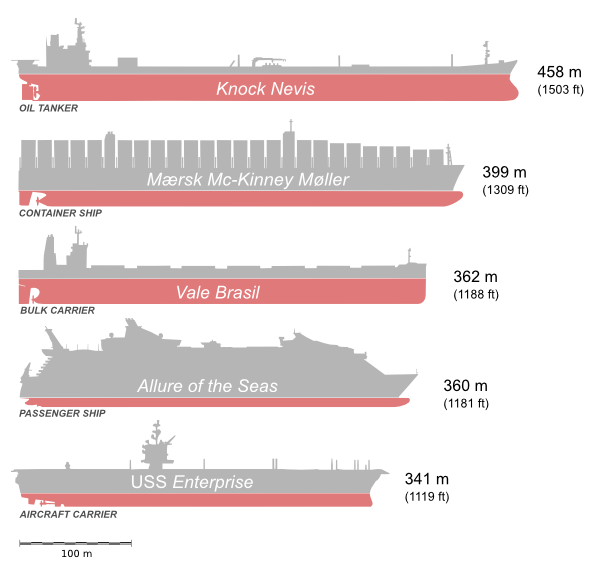

Unsupervised Learning Methods
-----------------------------

====================================== ========================================================================================
method                                 description
====================================== ========================================================================================
Principal Component Analysis (PCA)     maps data from *m* to *n* dimensions with *n* <= *m*. New dimensions are ranked.
Nonnegative Matrix Factorization (NMF) maps data to *n* dimensions with equivalent priority
K-means-clustering                     finds *k* spherical clusters
agglomerative clustering               hierarchical clustering merges points iteratively to a tree-like structure
DBScan                                 two hyperparameters control the number of clusters indirectly. Identifies outliers
t-SNE                                  reduces data to two dimensions, good for visualizing
Gaussian Mixture Models (GMM)          generative model that detects outliers
====================================== ========================================================================================

Exercises
---------

In this exercise, we will extract properties of ships. We will learn to
know both **Clustering** and **Principal Component Analysis**.

*Each exercise provides one **Character** of a solution. The Solution
has 15 characters and has to do with ships.*

Exercise 1
++++++++++

Read the file with the biggest ships in the world (:download:`ships.csv`) using
``pandas``. Set the index to the name of the ship.

Character 1:
^^^^^^^^^^^^

*The first character of the last ship.*

Exercise 2
++++++++++

Examine the data frame using pandas functions.

Character 2:
^^^^^^^^^^^^

*Which ship has a draft below 3 meters (first letter of status column)*

Exercise 3
++++++++++

Use the function ``df[COLNAME].value_counts()`` to gain an overview over
the columns *type* and *status*.

Character 3-5:
^^^^^^^^^^^^^^

*Last and second character of most frequent type*

*Last character of last* **status**

Exercise 4
++++++++++

Use ``pd.plotting.scatter_matrix(df)`` to see correlations.

Character 6:
^^^^^^^^^^^^

*Which histogram is more or less normally distributed (second character of column name)*

Exercise 5
++++++++++

Plot the length of ships against their height in a scatter plot
(use ``df.plot.scatter``).

Character 7:
^^^^^^^^^^^^

*Look for a group of three vertically aligned points at length 180m.
Take the first character of the height of the middle point (the number as a word).*

Exercise 6
++++++++++

One entry contains a **data error**. Examine the diagrams, find and
repair the error in the CSV file.

*Hint:* Try ``df[COLUMN].hist()`` or ``df[COLUMN].value_counts()``

Character 8:
^^^^^^^^^^^^

*What is the name of the ship with the error (second character)*

Exercise 7
++++++++++

Extract the columns **GRN, DWT, length, beam** and **draft**. Delete
the ``NaN`` values from the table *afterwards*.

Save the result in a *DataFrame* called ``subset``. Use
``print(df.shape)`` to make sure that the DataFrame contains **22**
entries.

Character 9:
^^^^^^^^^^^^

*What type do the columns have? (first character).*

Exercise 8
++++++++++

For processing the data with ``scikit-learn`` we will need a NumPy
array. Use an attribute of the DataFrame to obtain the array.

Store it in a variable ``X``.

Character 10:
^^^^^^^^^^^^^

*How is this attribute called? (last character)*

Exercise 9
++++++++++

Cluster the data using **KMeans**-clustering into 4 Clusters:

::

    from ______.cluster import KMeans

    kmeans = KMeans(______=4, random_state=0)
    kmeans.______(______)
    print(______.labels_)

Fill in the gaps: ``fit``, ``kmeans``, ``n_clusters``, ``sklearn``,
``X``

Character 11:
^^^^^^^^^^^^^

*Which word belongs into the first gap? (5th+6th character)*

Exercise 10
+++++++++++

Check http://scikit-learn.org in the section

::

    4.3. Preprocessing data

Scale the data to values between 0 and 1. Save the scaled array in a
variable. Repeat the clustering. Do the cluster assignments change?

The following command saves the clusters in the cleaned DataFrame:

::

    subset['cluster'] = kmeans.labels_

Characters 12:
^^^^^^^^^^^^^^

*Which is the deepest ship in the same cluster as the 'Kizomba A'? (last character)*

Exercise 11
+++++++++++

Color the clusters. You need a function ``assign_color(cluster)`` that
gets the cluster number (0 - 3) and returns a color, e.g.
(``'blue', 'green', 'red'`` or ``'orange'``).

**Fix the bugs in the code**

.. code:: python3

    def assign_clr(cluter):
        return ["blue", "green", "red", "range"][cluter]

    colrs = ubet['cluter'].apply(aign_color)
    ubet.plt.catter('length', 'beam', ubset['length'] / 5, c=clr)
    plt.avefig('clusters.png')

Characters 13+14:
^^^^^^^^^^^^^^^^^

*The two characters that needed to be fixed, in alphabetical order.*

Exercise 12
+++++++++++

Finally, we run a **PCA**. The following code identifies two principal
components. There are three bugs in the code. Find and fix them.

::
    from sklearn.decomposition import PCA

    pca = PCA(n_components=2)
    pca.fit(X)
    xt = pca.transform(x)

    plt.figure{}
    plt.plot(xt[:, 0], xt[:, 1], 'ro')
    plt.savefig(principalcomponents.png)

Character 15:
^^^^^^^^^^^^^

*The last character in the abbreviation of* **Principal Component Analysis**

Exercise 13
+++++++++++

Show the components with:

::

    print(pca.components_)

Plot the components using a heatmap:

::

    names = list(subset.columns)

    plt.figure()
    plt.matshow(pca.components_, cmap='viridis')
    plt.yticks([0, 1], ["1. PC", "2. PC"])
    plt.colorbar()
    plt.xticks(range(len(names)), names, rotation=60, ha='left')
    plt.xlabel('Feature')
    plt.ylabel('Principal Components')
    plt.savefig('PCA_heatmap.png')

Sources
-------

`List of Ships:
Wikipedia <https://de.wikipedia.org/wiki/Liste_der_gr%C3%B6%C3%9Ften_Schiffe_der_Welt>`__

*Ships: Wikimedia Commons; Delphine Ménard (notafish) CC BY SA 2.0*

The exercises in this folder are:

(c) 2015 Dr. Kristian Rother (krother@academis.eu)

with contributions by Allegra Via, Kaja Milanowska, Anna Philips,
Magdalena Rother and Tomasz Puton.

Distributed under the conditions of the Creative Commons Attribution
Share-alike License 4.0

See https://github.com/krother/Python3\_Basics\_Tutorial and
https://www.gitbook.com/book/krother/python-3-reference.
