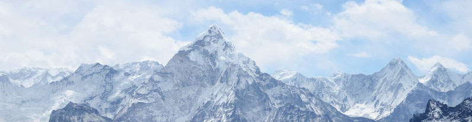

Misty Mountains
---------------

*Photo by `Rohit Tandon on unsplash.com <https://unsplash.com/@sepoys?utm_content=creditCopyText&utm_medium=referral&utm_source=unsplash>`__*
  
**🎯 Find the highest peak.**

You are looking for the dwarven cities.
They are under the highest mountains, of course.
As you scan the horizon, you can clearly see the elevation of each mountain:

::

   310
   464
   618
   772
   926
   1080
   ...

A peak is any elevation with two lower numbers before and after it.
Every peak hosts one of the dwarven cities. You find the elevations in
:download:`mountains.csv`.

* find the highest peak
* find all seven peaks

Extra challenge
---------------

Plot the elevations of the mountains as a line plot.
