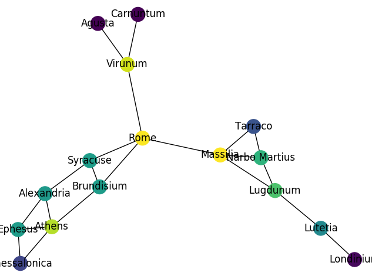

PageRank
========

The **PageRank** algorithm calculates **network centrality**, the most important nodes in a graph.

It was introduced by *Larry Page* to rank search results in Google.

How it works
------------

Imagine random movement through a graph. The relative frequency how often a node is visited is equivalent to its PageRank.

The calculation is based on **Eigenvectors** and **Eigenvalues**.

Example
-------

The **NetworkX library** calculates PageRank in Python:

   
*Roman cities colored by PageRank*

Files: :download:`page_rank.py <page_rank.py>` :download:`cities.csv <cities.csv>`

.. literalinclude:: page_rank.py

