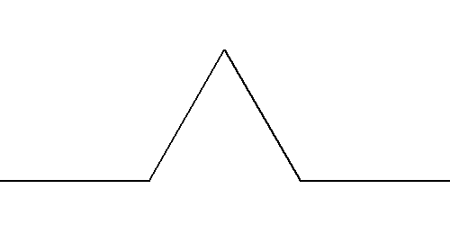

# Recursive Graphics

**🎯 Write a programm that draws the Koch curve.**

With the parameter `n=1` draw a basic shape composed of four lines:

If you increase `n`, each line should be replaced by a smaller edition of the basic shape. For example, with `n=2` you should get:

and with `n=5`:

## Hints

* without **recursion** you won't get very far
* use `turtle` or `pillow` for drawing

## Extra Challenge

* Modify the basic shape so that the result is a bush or tree instead of a snowflake.

*Translated with [www.DeepL.com](www.DeepL.com/Translator)*
