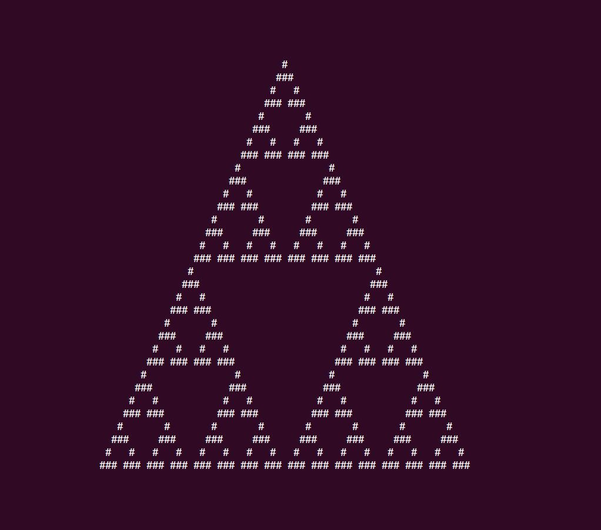

Sierpinski Triangle
===================

**🎯 Construct a Sierpinski Triangle with a Cellular Automaton.**

Consider the following rules:

.. code:: python3

   rules = {
       '   ': ' ',
       '  #': '#',
       ' # ': '#',
       ' ##': ' ',
       '#  ': '#',
       '# #': ' ',
       '## ': ' ',
       '###': ' ',
   }

Now when you start with a string consisting of a single hash flanked by spaces:

::

   #

The rules define how the next line looks like.
For the new line you look up character triplets from the original string.
The three triplets `"  #", " # ", "#  "` involving the original hash result in a new hash each.
So the second line is:

::

   ###

If you propagate that line once again, the triplets with two hashes reult in a space:

::

   #   #

If you propagate once again, the first four lines look like:

::

      #
     ###
    #   #
   ### ###

Write a program that propagates the following line 32 times:

.. code:: python3
   
   line = " " * 32 + "#" + " " * 32

Add an empty space at the beginning and end of each new line so that the line length stays the same.

.. hint::

   Experiment with the rule set defined by the dictionary by changing its values.

What you can practise in this coding challenge
----------------------------------------------

-  loops
-  string operations
-  looking up things in dictionaries

.. seealso::

   `Sierpinski Triangle on Wikipedia <https://en.wikipedia.org/wiki/Sierpi%C5%84ski_triangle>`__