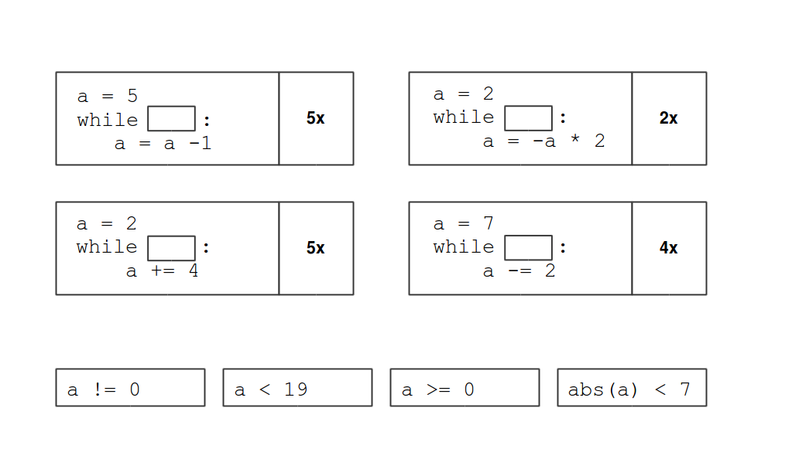

# Control flow statements

Control flow means controlling, which instruction is handled next. In this tutorial, we cover three of Pythons control flow statements: `for`, `if` and `while`.

## Conditional loops with while

## Exercise
Match the expressions so that the `while` loops run the designated number of times.

While loops combine `for` and `if`. They require a conditional expression at the beginning. The conditional expressions work in exactly the same way as in `if.. elif` statements.

    i = 0
    while i < 5:
        print (i)
        i = i + 1)

### When to use while?

* When there is an exit condition.
* When it may happen that nothing is done at all.
* When the number of repeats depends on user input.
* Searching for a particular element in a list.

## Exercises

### Exercise 1

Which of these `while` commands are correct?

- [ ] `while a = 1:`
- [ ] `while b == 1`
- [ ] `while a + 7:`
- [ ] `while len(c) > 10:`
- [ ] `while a and (b-2 == c):`
- [ ] `while s.find('c') >= 0:`

### Exercise 2

Which statements are correct?

- [ ] `while` is also called a conditional loop
- [ ] The expression after `while` may contain function calls
- [ ] It is possible to write endless `while` loops
- [ ] The colon after `while` may be omitted
- [ ] The code block after `while` is executed at least once

