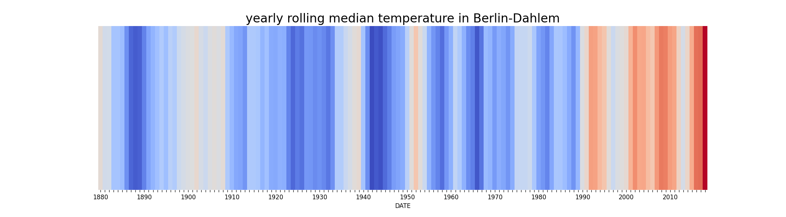

# Climate Stripes

In this exercise, you will reproduce the famous [climate stripe cover from the Economist](https://www.economist.com/leaders/2019/09/19/the-climate-issue).

### Step 1: Get climate data from ECAD

* go to [www.ecad.eu](https://www.ecad.eu)
* go to *"Daily data"*
* click on *"Custom query (ASCII)"*
* set fields as in the table:

| field | value |
|-------|-------|
| Type of series | blend |
| Country | `your country` |
| Location | `your city or area` |
| Element | Mean temperature |

* click on *"Next"*
* click on *"Download"* and download the data

**Important: The ECAD data is made available for public use.
However, do not redistribute the raw data (on your GitHub profile or elsewhere)**

----

### Step 2: Read the data into a DataFrame

Reading the ECAD data into pandas is a bit trickier than a standard CSV file.
You will need to inspect the file in a text editor (not Excel).
Pay attention to the following:

* what is the column separator?
* are there any headers?
* how many lines contain comments before the real data starts?

Look up the parameters of `pd.read_csv()`. They are sufficient to read the file.

----

### Step 3: Data Wrangling

The **TG** column contains the temperature measured in 0.1 Celsius degrees.
This was probably established decades ago when disk space and memory were more expensive (integers take less space).

* Create a new column by dividing the temperature by 10.
* Plot the raw temperature data as a line plot.

----

### Step 4: Time Axis

The `DATE` column contains timestamps in the `YYYYMMDD` format.
You need to convert these to pandas timestamps.

First, convert the DATE column to a string data type.
 
Second, use the following expression to slice off year, month and day:

    :::python3
    df['year'] = df[col].str[x:y]

Put the elements into separate columns.
Then, create a new date column via string concatenation:

    :::python3
    df[col1] + '-' + df[col2]

The final date column should have the format **YYYY-MM-DD**.
Now you can convert the strings with dates into a timestamp index with:

    :::python3
    df.set_index(pd.to_datetime(date_series))

Plot the temperature as a line plot again.
Now, the x-axis should look much better.

----

### Step 5: Missing Values

For some cities, the data may contain missing values.
In the original files the value `-9999` is used.
This can be done with the `replace()` method:

    :::python3
    df[col].replace(-999.9, new_value)  # after scaling

As a new value, use the overall median temperature.
Place the result of the expression in a new column.

#### Hint:
Instead of the median, you could average over the year before and after the gap or take the mean of exactly the same day of the adjacent years.

----

### Step 6: Cut off the last year

Before calculating median temperatures, make sure the last year is complete as well.
It can be cut off by slicing the index with a simple date string.
Pandas takes care of the parsing:

    :::python3
    df.loc[:'2021-12-31']

----

### Step 7: Aggregate

Now reduce the data to one value per year using the median.
This could be done with a `df.groupby()`:

    :::python3
    df.groupby('year')[col2].median()

However, with a timestamp index it is better to use `df.resample()`:

    :::python3
    yearly = df.resample(freq='Y').median()

The resampling has the advantage that you still have a timestamp index after the operation.

You may want to create a DataFrame out of the series:

    :::python3
    df = pd.DataFrame(yearly)
    
Plot the aggregate as a line plot again.

#### Hint:

You may want to try out resampling different frequencies.
`pandas` understands frequency values like `'3M2d5h10sec'`

See [Offset Aliases](https://pandas.pydata.org/pandas-docs/stable/user_guide/timeseries.html#timeseries-offset-aliases) for a list of all options in pandas.

----

### Step 7: Heatmap

The `seaborn` library has a heatmap function that you can use to plot the stripes.

    :::python3
    cmap = plt.get_cmap('coolwarm')

    plt.figure(figsize=(15, 5))
    plt.title('yearly median temperature in Berlin-Dahlem')
    sns.heatmap(df, cmap=cmap, cbar=False, yticklabels=[], xticklabels=[])

Save your stripe image to a file.

#### Hints:

* make sure that your data is a single-column DataFrame
* try `df.transpose()` if you want to have the stripes the other way
* before plotting, setting the index to the year makes nicer tick labels.
* if you put a typo in the name of the color map (*coolwarm*), matplotlib prints the available options
* of course you could download multiple files and create a diagram with multiple rows of stripes

----

### Bonus: Smoothing

Before the resampling, you may average over a 5-year window (rolling mean):

    ts = df['temp'].rolling(window=5 * 365).mean()
    ts.plot()

Compare the resulting heatmap.
