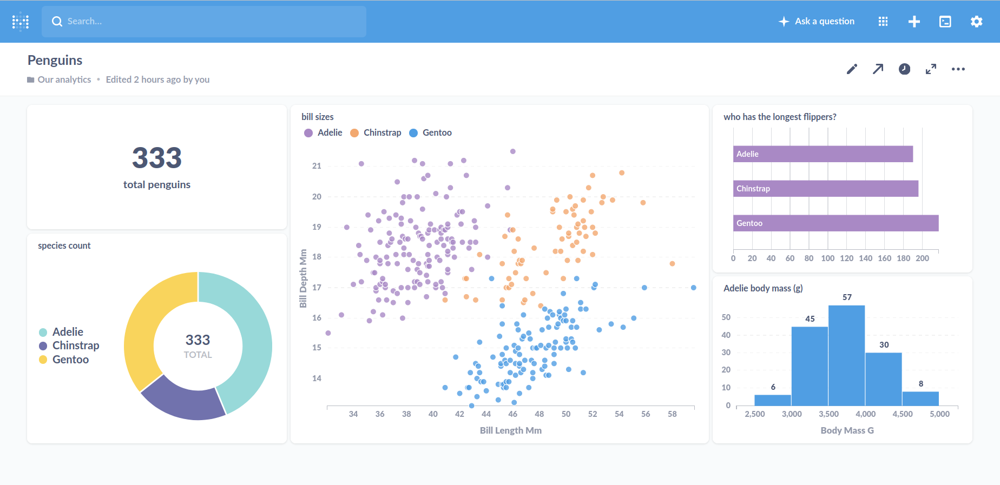

# Penguin Dashboard

In this tutorial, you will build a dashboard like this one using **Metabase** and **Docker Compose**:

The data are 333 penguins stored in the file :::file ../images/penguins.csv

----

## 1. Install Docker and Docker Compose

Please follow the instructions on the

* [Docker Documentation](https://docs.docker.com/)
* [Docker Compose Install Guide](https://docs.docker.com/compose/install/)

**On Linux**, you may want to follow the [postinstall guide](https://docs.docker.com/install/linux/linux-postinstall/#manage-docker-as-a-non-root-user) so that you don't need to type `sudo` every time you want to run a docker command.

**On Windows**, the installation can be tricky without Windows Pro. If you need to use WSL2 installation, lease stick to the [WSL2 install guide](https://docs.docker.com/docker-for-windows/wsl/). Also check out the [Checklist by @bonartm](https://gist.github.com/bonartm/2b754a61218daa9da64e94da620d8f18).

**On MacOS**, the installation is rather straightforward.

Run on your terminal:

    :::bash
    docker run hello-world

You should see that docker downloads a container image and prints a welcome message.

    :::text
    Hello from Docker!
    This message shows that your installation appears to be working correctly.

    To generate this message, Docker took the following steps:

    ...

----

## 2. Create a database container

Create a new project folder. In that folder, create a file `docker-compose.yml` with the following:

    :::text
    version: '3'
    services:

      pg_database:
        image: postgres:13.0
        environment:
        - POSTGRES_PASSWORD=1234
        - POSTGRES_USER=postgres
        - POSTGRES_DB=pingubase

Now run the container. Go to your project folder on the terminal and type:

    :::bash
    docker-compose up

At the end of a lot of output, you should see the message:

    :::text
    database system is ready to accept connections

Stop `docker-compose` with **Ctrl-C**.

----

## 3. Add a table

To add the data, you need to create a table first. 
Create a folder `sql_init/` and add a file `penguins.sql`:

    :::sql
    CREATE TABLE IF NOT EXISTS penguins (

      id SERIAL PRIMARY KEY,
      species VARCHAR(12),
      bill_length_mm NUMERIC

    );    

You need to tell docker to share this folder with the postgres container.
The docker `postgres` image will execute all SQL scripts in the folder `/docker-entrypoint-initdb.d` when the container is started for the first time.

Add the following lines to `docker-compose.yml` in the `pg_database` section:

    :::text
    volumes:
    - ./sql_init/:/docker-entrypoint-initdb.d

Now tear down the container and recreate it with:

    :::bash
    docker-compose down
    docker-compose up

You should see the `CREATE TABLE` statement finish without errors in the output.

Stop the container again.

----

## 4. Add data

The database is still empty.
To fill it with data, you need to do a few things:

1. Add the CSV file :::file ../images/penguins.csv to the `sql_init/` folder (where `penguins.sql` is already).
2. Inspect the columns in the CSV file and what type they have
3. Add the necessary columns to the `CREATE TABLE` statement
4. Tear down the container with `docker-compose down`. Otherwise the `.sql` script won't be executed.
5. Add the new columns to the `COPY` command below (but leave away `id`):

**SQL command to load data:**

    :::sql
    COPY penguins (species, bill_length_mm, ...) 
      FROM '/docker-entrypoint-initdb.d/penguins.csv' CSV HEADER DELIMITER ';';
      
Now you can start the container again.
You should see **`COPY 333`** somewhere in the output.

----

## 5. Inspect the data

Let's make sure that the penguins are really in the database.
Keep the container running (or restart it with `docker-compose up`).

Now open a *second* terminal and go to your project folder.
There, we execute the interactive postgres command line via docker:

    :::bash
    docker-compose exec pg_database psql -U postgres -d pingubase

If it works, type:

    :::sql
    SELECT * FROM penguins;

You should be able to scroll through a table with 333 rows.

----

## 6. The Dashboard Container

The [Metabase](https://www.metabase.com) dashboard will run in a separate container.
In this section, you need to edit the `docker-compose.yml` file so that it starts two containers instead of one.

First, create a new folder `metabase_data/` in your project directory. This folder will contain your dashboard, so that your settings are preserved even when you delete the container with `docker-compose down` .

Add the new container by pasting the following code (`dashboard` should be at the same indentation level as `pg_database`):

    :::text
    dashboard:
      image: metabase/metabase:latest
      ports:
      - 3000:3000
      volumes:
      - ./metabase_data/:/metabase-data
      environment:
      - MB_DB_FILE=/metabase-data/metabase.db
      depends_on:
      - pg_database

Then restart the service with

    :::bash
    docker-compose up

Go to your broser on [http://localhost:3000](http://localhost:3000). You should see the Metabase welcome screen.

----

## 7. Setting up Metabase

Before you can create a dashboard, you need to tell Metabase who you are and where the data is.
First, create an account with a name, email and password (it does not have to be your real email).

Next, configure the database. You need:

* **The database type:** PostgreSQL
* **Name:** any (this name is only used by Metbase)
* **Host:** `pg_database` (the name of the other container)
* **Port:** `5432
* **Database name:** `pingubase` (the one specified in `docker-compose.yml`)
* **Password:** The password you specified in `docker-compose.yml`

You find a detailed [Setup Guid in the Metabase docs](https://www.metabase.com/docs/latest/setting-up-metabase.html).

If everything works, you should get to the main screen of Metabase, where you can already see your penguin database. There are multiple buttons where you can create tables, plots and add them to a dashboard. 

**Don't forget to press the "Save" button after editing your plots and the dashboard!**

----

## 8. More security with and .env file

If everything works until here, you can create nice dashboards for your own data.
But there is still a major flaw: You shouldn't publish your code on GitHub, because it contains the database password (and `1234` is not a good password anyway).

To increase security and make your application more flexible, you could move some of the settings to **environment variables**. Create a file called `.env` in your project folder. Add the line

    :::text
    POSTGRES_PASSWORD=1234

Now, open `docker-compose.yml` in your editor and change the line with the password to 

    :::text
    - POSTGRES_PASSWORD=${POSTGRES_PASSWORD}

It now should use the environment variable from `.env` automatically.

You can check your configuration for errors with:

    :::bash
    docker-compose config

When you run the app again with `docker-compose up`, you should see the same dashboard as before.

Try moving other environment variables to `.env` as well.

Have fun building dashboards!

----

## 9. Extra hints

Here is a complete list of all files in the project folder (the `metabase.db` files are created automatically):

    :::text
    pingubase_project/
        docker-compose.yml
        metabase_data/
            metabase.db/
                metabase.db.mv.db
                metabase.db.trace.db
        sql_init/
            penguins.csv
            penguins.sql
