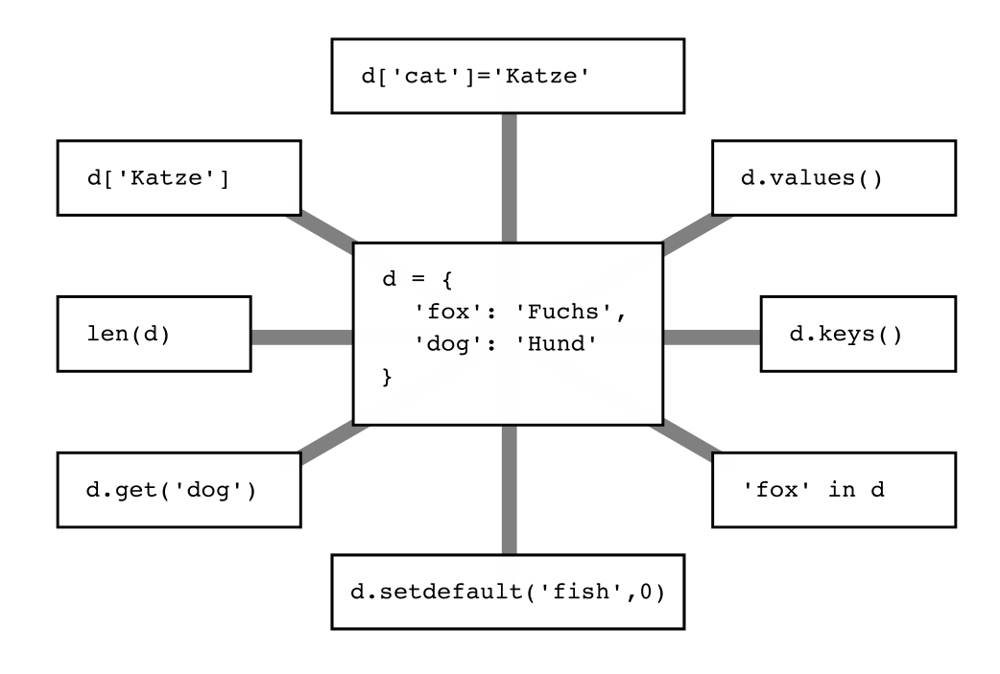

# Dictionaries

### Exercise 1

Find out what each of the expressions does to the dictionary in the center.

----

### Exercise 2

What do these commands produce?

    :::python3
    d = {'cat':'Katze', 'dog':'Hund', 'fish':'Fisch'}
    print(d['fish'])
    
----

### Exercise 3

What do these commands produce?

    :::python3
    d = {'cat':'Katze', 'dog':'Hund', 'fish':'Fisch'}
    print('Hund' in d)

----

### Exercise 4

What do these commands produce?

    :::python3
    d = {'cat':'Katze', 'dog':'Hund', 'fish':'Fisch'}
    print(list(d.keys()))

----

### Exercise 5

What do these commands produce?

    :::python3
    d = {'cat':'Katze', 'dog':'Hund', 'fish':'Fisch'}
    print(d.get('Katze', 'unknown'))

----

### Exercise 6

What do these commands produce?

    :::python3
    d = {'cat':'Katze', 'dog':'Hund', 'fish':'Fisch'}
    d.setdefault('cat', 'Stubentiger')
    print(d['cat'])

----

### Exercise 7

The following program allows you to travel from one city to the next.
Unfortunately, it contains **3 bugs**. Find and fix them.

    :::python3
    cities = {
        "New York": ["Tokyo", "Paris", "London"],
        "Poznan": ["London", "Berlin"],
        "London": ["New York", "Poznan"]
        "Berlin": ["Tokyo", "Poznan"],
        "Tokyo": ["New York", "Berlin"],
        "Paris": ["Katmandu"]
        }
    
    location = "Paris"
    
    print "\nYour task: fly to Katmandu\n"
    
    while location in cities and location == 'Katmandu':
        print(f"You are in {location}")
    
    print("There are flights to ", cities[location])
    location = input("Where would you like to travel?")

    print("You have reached your destination")
    