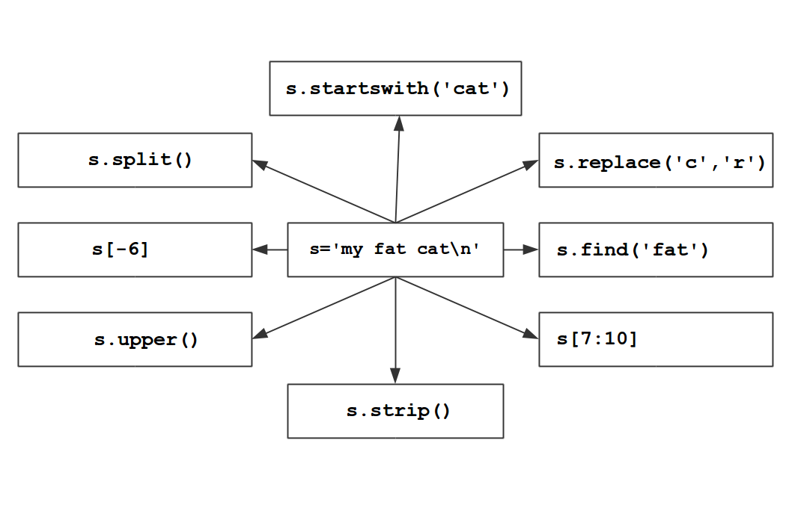

# Strings

In this chapter you will store text (**strings**) in variables.

## Exercise 1: Indexing and slicing strings

What do the following expressions result in?

    name = "Ada Lovelace"

    name[0]
    name[3]
    name[-1]
    name[0] + name[6]
    name[5:]
    name[5:10]
    name[:10:2]

----

## Exercise 2: Decypher

The following text contains an encrypted word:

    name = "CSAIPRALKAINACZEYLVOST"

Print every second character, starting with the 2nd).

----

## Exercise 3: String methods

Find out what the expressions do to the string in the middle.

----

## Exercise 4: String parsing

Store all the first characters of every name in a new string.

    names = """
    Adelie
    Bartek
    Charly
    Djamal
    Emilia
    Florin
    """

----

## Recap: String manipulation

Fill in the blanks so that the assertions pass

    s = "Hello"

    # 1. Concatenate the string
    ...
    assert s == "Hello World"

    # 2. Convert the string to upper case
    ...
    assert s == "HELLO WORLD"

    # 3. Exract the first word
    ...
    assert s == "HELLO"

    # 4. Capitalize the string
    ...
    assert s == "Hello"

    # 5. Substitute characters
    ...
    assert s == "Hero"

----

## Reflection questions

* Can you modify a string?
* Is there a difference between single-quoted and triple-quoted strings?
* What characters start with a backslash?
