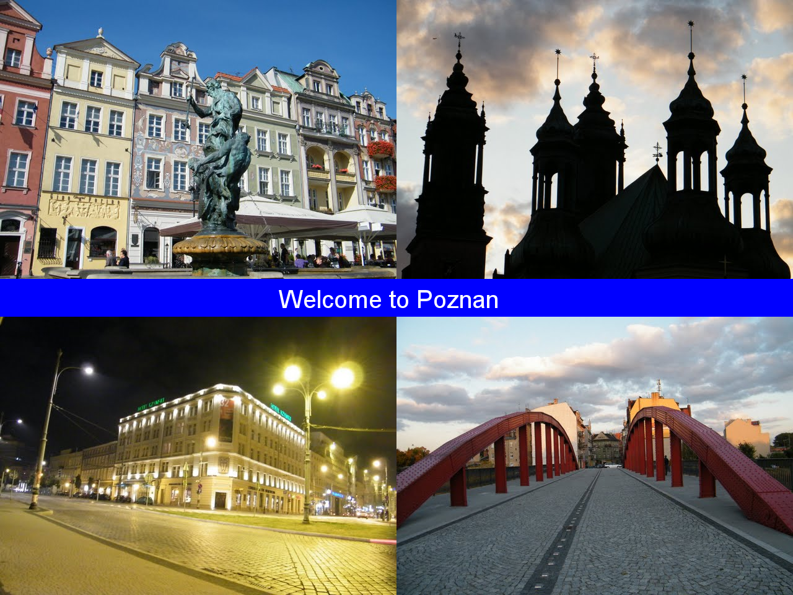

# Create a Postcard

Write a program that creates a postcard for the city of your choice.

## 1. Install Pillow

    `pip install pillow`

(it is already installed with Anaconda)

## 2. Learn to know PIL

### Exercise 2.1

Run the program `example01.py`. What does it do?

### Exercise 2.2

Change the numbers in the program, so that you create a square-shaped image.

## 3. Drawing shapes

### Exercise 3.1

Run the program `example02.py`. What does it do?

### Exercise 3.2

Add a broad horizontal bar to an image of your favourite city.

### Exercise 3.3

**for fast students**

Draw a 8-pointed star on an image of your favourite city. 

**Hint:** You can compose such a star from squares, triangles or polygons.

## 4. Drawing text

### Exercise 4.1

Run the program `example03.py`. What does it do?

### Exercise 4.2

Write the text *"Welcome to (your city)"* to the shape from exercise 3.2.

## 5. Composing images

### Exercise 5.1

Run the program `example04.py`. What does it do?

### Exercise 5.2

Create a postcard composed of four smaller pictures, the horizontal bar and some text on it.

## 6. Applying filters

### Exercise 6.1

Run the program `example05.py`. What does it do?

### Exercise 6.2

Be creative!

## License

(c) 2015 Dr. Kristian Rother and Magdalena Rother

Distributed under the conditions of the Creative Commons Attribution Share-alike License 4.0

