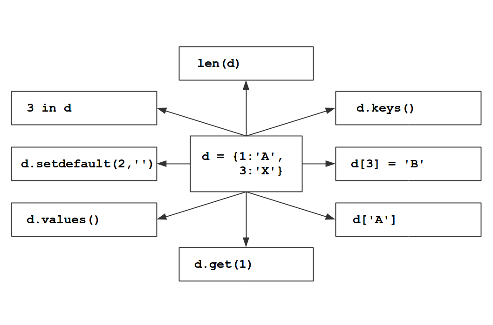

# Methoden von Dictionaries

### Aufgabe 1

Finde heraus, was jeder der Ausdrücke mit dem Dictionary in der Mitte anstellt.

### Aufgabe 2 

Was haben folgende Anweisungen zum Ergebnis?

    d = {1:'A', 'B':1, 'A':True}
    print(d['A'])

* `False`
* `"B"`
* `True`
* `1`

### Aufgabe 3

Was haben folgende Anweisungen zum Ergebnis?

    d = {1:'A', 'B':1, 'A':True}
    print(d.has_key('B'))

* `1`
* `True`
* `"B"`
* `False`

### Aufgabe 4

Was haben folgende Anweisungen zum Ergebnis?

    d = {1:'A', 'B':1, 'A':True}
    print(d.values())

* `True`
* `['A', 1, True]`
* `3`
* `[1, 'B', 'A']`

### Aufgabe 5

Was haben folgende Anweisungen zum Ergebnis?

    d = {1:'A', 'B':1, 'A':True}
    print(d.keys())

* `[1, 'B', 'A']`
* `['A', 'B', 1]`
* `[1, 'A', 'B']`
* Die Reihenfolge ist nicht vorhersagbar.

### Aufgabe 6

Was haben folgende Anweisungen zum Ergebnis?

    d = {1:'A', 'B':1, 'A':True}
    print(d['C'])

* `None`
* `'C'`
* eine Fehlermeldung
* `False`

### Exercise 7

Was haben folgende Anweisungen zum Ergebnis?

    d = {1:'A', 'B':1, 'A':True}
    d.setdefault('C', 3)
    print(d['C'])

* `3`
* `'C'`
* `None`
* eine Fehlermeldung
