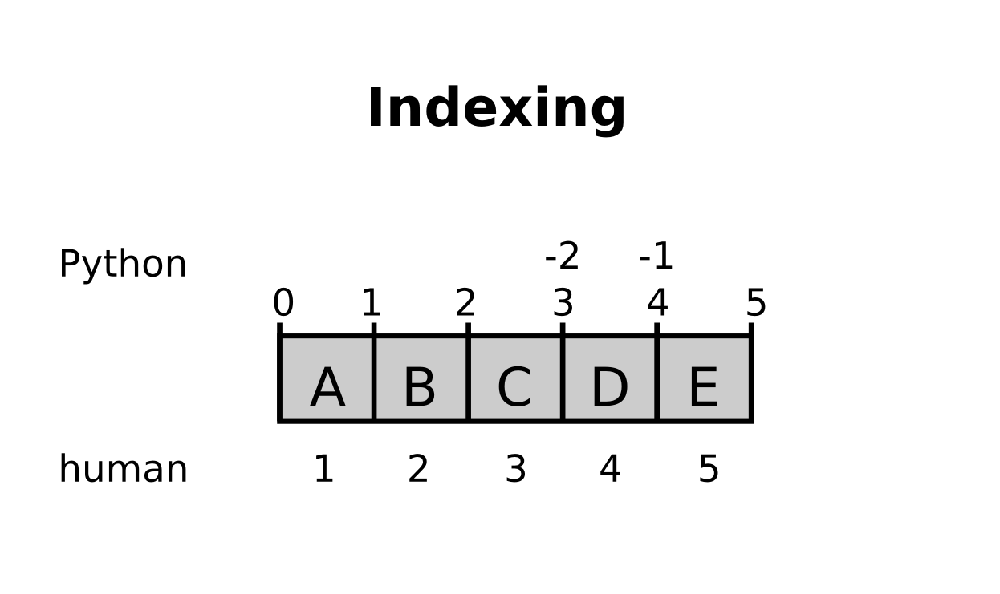

# Strings und Listen

Bisher haben wir lediglich mit Zahlen gearbeitet. Nun werden wir auch Text (**Strings**) in Variablen speichern und mehrere Variablen in einer **Liste** zusammenfassen.

## Strings

### Aufgabe 1

Probiere die folgenden Anweisungen aus, um Textvariablen oder **Strings** zu erzeugen:

    In [1]: vorname = 'Emily'
    In [2]: nachname = "Smith"
    In [3]: name = vorname + " " + nachname
    In [4]: name

### Aufgabe 2

Was ergeben die folgenden Anweisungen?

    In [5]: name[0]
    In [6]: name[3]
    In [7]: name[-1]
    In [8]: name[0] + name[6]

### Aufgabe 4

Gib die beiden Initialien aus dem folgenden String aus. Verwende die Schreibweise mit eckigen Klammern:

    name = "Walter White"

### Aufgabe 5

Erkläre die folgende Anweisung:

    print("Emily\tSmith\n2000")

# Listen

Um größere Datenmengen zu verarbeiten, können wir nicht für jeden Eintrag einen neuen Variablennamen ausdenken. Irgendwie muß es möglich sein, mehrere Datensätze in einer Variable zu speichern. In Python treten an dieser Stelle **Listen** auf die Bühne.

Listen sind eine einfache Abfolge von Elementen. Allerdings zählt Python anders als Menschen:

### Aufgabe 1

Probiere einige Befehle zum Erstellen von Listen aus:

    In [1]: zahlen = [1, 2, 4, 8, 16, 32]
    In [2]: zahlen = zahlen + [64, 128, 256]

    In [3]: filme = ["Star Wars", "Star Trek", "Ratatouille"]
    In [4]: filme += ["Arrival"]

### Aufgabe 2

Was ergeben folgende Anweisungen?

    In [5]: zahlen[4]
    In [6]: filme[0]
    In [7]: filme[-1]
    In [8]: zahlen[-3]

### Aufgabe 3

Was ergeben folgende Anweisungen?

    In [9]: filme[2:]
    In [10]: filme[:2]
    In [11]: zahlen[2:-2]
    In [12]: zahlen[::2]

### Aufgabe 4

<quiz name="">
    <question multiple>

Welche Anweisungen sind korrekt?

    <answer correct><code>daten = ["Tilda", "Swinton"]</code></answer>
    <answer><code>daten = ["Darth Vader" "Yoda"]</code></answer>
    <answer correct><code>daten = [1, 2 + 3, 4]</code></answer>
    <answer correct><code>daten = [1, 2] + [3, 4]</code></answer>
    <answer><code>daten = [1, 2] + 3, 4]</code></answer>
    <answer correct><code>daten = [1, 2.0, "drei"]</code></answer>
    <explanation></explanation>
    </question>
</quiz>

### Aufgabe 5

Gegeben ist ein chiffriertes Wort:

    name = "CSAIPRALKAINACZEYLVOST"

Gib jeden zweiten Buchstaben des Wortes (beginnend beim 2.) aus.

### Aufgabe 6

Schreibe ein Programm, welches die Anzahl der Buchstaben im Namen `Stefani Joanne Angelina Germanotta` ermittelt. **Leerzeichen zählen mit!**

### Aufgabe 7

Was tut das folgende Programm?

    text = ""
    characters = "Hannah"
    for char in characters:
        text = char + text
    print(text)

### Aufgabe 8

Bilde Paare von Datentypen und Werten.

