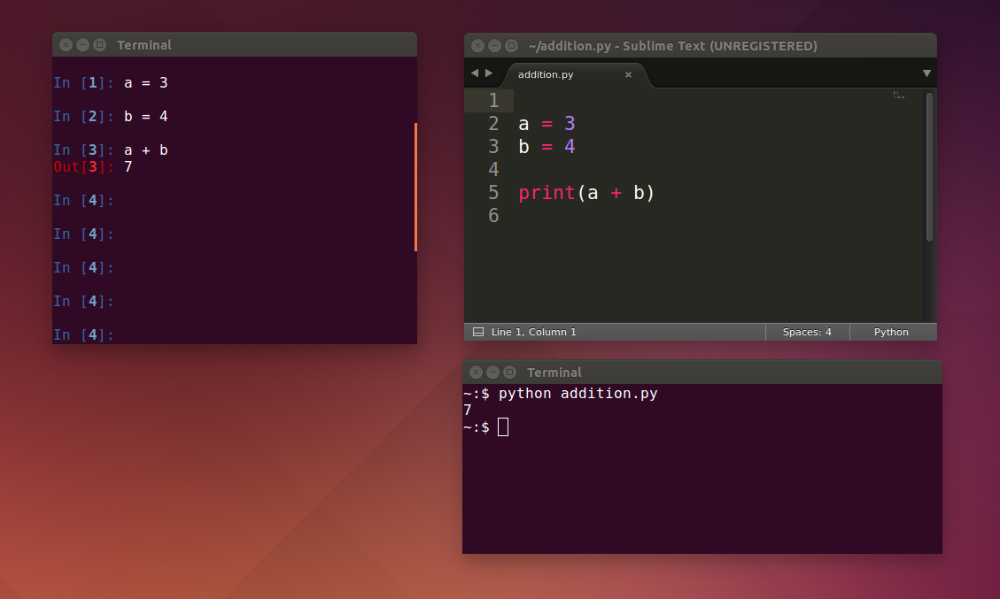

# Python als Taschenrechner

Es gibt mehrere Möglichkeiten, Python zu verwenden. Im Editor **Anaconda Spyder** findest Du rechts unten die interaktive *Python-Shell*. Links kannst Du *Programme* mit mehreren Befehlen schreiben.

### Aufgabe 1

In diesem Abschnitt werden wir zuerst die Python-Shell als Taschenrechner ausprobieren. Du solltest folgende Eingabeaufforderung sehen:

    In [1]:

Führe einige Berechnungen in Python durch, indem Du die fehlenden Zeichen in die Lücken einsetzt:

    In [1]: 1 + ___
    Out[1]: 3

    In [2]: 12 ___ 8
    Out[2]: 4

    In [3]: ___ * 5
    Out[3]: 20

    In [4]: 21 / 7
    Out[4]: ___

    In [5]: ___ ** 2
    Out[5]: 81

Gib die Befehle ein und schau was passiert. Gib den ersten Teil (`In [1]` etc.) **nicht** ein, diese erscheinen automatisch.

### Aufgabe

Was ist der Unterschied zwischen folgenden Anweisungen?

    10 / 3
    10.0 / 3
    10.0 / 3.0
    10 // 3

### Aufgabe 2

Welche Operationen ergeben 8?

* `0 + 8`
* `4 4`
* `8 /`
* `65 // 8`
* `17 % 9`
* `2 * * 4`
* `64 ** 0.5`

### Aufgabe 3

Um Zahlen und Rechenergebnisse für spätere Berechnungen aufzuheben, können wir sie in **Variablen** speichern.

Ergänze die Lücken:

    In [1]: emily = 25952
    In [2]: hannah = 23073
    In [3]: sarah = 5
    In [4]: emily
    Out[4]: ______
    In [5]: hannah + 1
    Out[5]: ______
    In [6]: 3 * sarah
    Out[6]: ______

### Aufgabe 4

Ändere den Inhalt der Variablen:

    In [7]: emily = emily + 1
    In [8]: emily
    Out[8]: _____

    In [9]: summe = _____ + _____ + _____
    In [10]: summe
    Out[10]: 49031

Setze die korrekten Werte und Variablennamen ein.

### Aufgabe 5

Welche der folgenden Variablennamen sind in Python erlaubt? Versuche einige Zahlen darin abzuspeichern.

    Sarah
    ASHLEY
    madison alexis
    sam90
    2000jessy
    liz_lauren
    alyssa.kay

### Aufgabe 6

Welche **Zuweisungen** an Variablen sind korrekt?

* `a = 1 * 2`
* `2 = 1 + 1`
* `5 + 6 = y`
* `sieben = 3 * 4`

### Aufgabe

    import math
    math.log(16, 2)

    math.sin(math.pi / 2)

https://docs.python.org/3/library/math.html