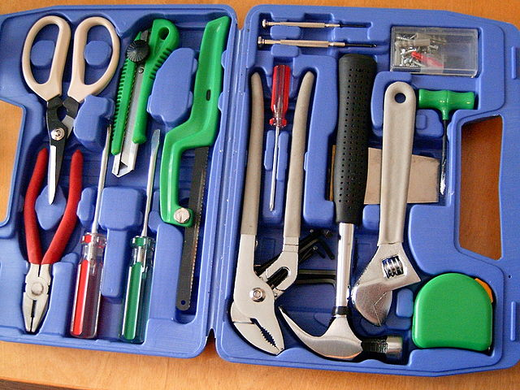

# Funktionen

*[Von Per Erik Strandberg sv:User:PER9000 - Eigenes Werk, CC BY-SA 2.5](https://commons.wikimedia.org/w/index.php?curid=830530)*

**Funktionen** sind beim Schreiben eines Programmes wie Werkzeuge. Jede Funktion ist ein Werkzeug zum Bearbeiten von Daten auf eine bestimmte Weise.

Funktionen in Python dienen dazu:

* nicht alles selbst schreiben zu müssen
* komplizierte Programme zu vereinfachen
* oft verwendete Programmteile zu strukturieren

In diesem Kursteil werden wir bestehende **Python-Funktionen besser kennen lernen** und **eigene Funktionen schreiben**.
