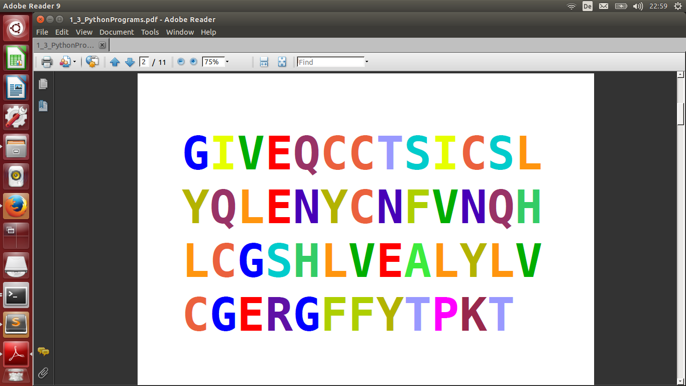

# Entscheidungen treffen

**Wie oft kommte der Buchstabe 'C' vor?**

Mit den bisherigen Python-Befehlen lassen sich bereits eine ganze Menge unterschiedliche Programme schreiben. Es fehlt uns allerdings noch eine wichtige Möglichkeit: Im Programm *Entscheidungen zu treffen*. In Python gibt es für Entscheidungen (Verzweigungen) die `if`-Anweisung. Darum geht es in diesem Kursteil.

### Aufgabe 1

Führe das folgende Programm aus und erkläre die Ausgabe:

    anzahl = 123

    if anzahl > 1000:
        print("Die Anzahl ist größer als 1000.")
    elif anzahl == 1000:
        print("Die Anzahl ist genau 1000.")
    else:
        print("Die Anzahl ist kleiner als 1000.")

### Aufgabe 2

Setze `name` nacheinander so, daß eine, zwei oder alle drei Bedingungen erfüllt sind

    name = ____

    if "m" in name:
        print("Es kommt ein 'm' im Namen vor.")
        if name != "Mimi":
            print("Der Name ist nicht Mimi.")
            if name[0] == "M" and name[-1] == "m":
                print("Der Name beginnt mit M und endet auf m.")

### Aufgabe 3

Das folgende Programm soll die Positionen aller Buchstaben *"n"* im Namen ausgeben. Leider enthält das Programm **drei Fehler**. Bringe das Programm zum Laufen:

    name = "Anna"
    position = 1

    for buchstabe in name
        if buchstabe = "n":
            print(position)
    position = position + 1

### Aufgabe 4

Welche der folgenden `if`-Anweisungen ist syntaktisch korrekt?

* `if a and b:`
* `if len(s) == 23:`
* `if a but not b < 3:`
* `if a ** 2 >= 49:`
* `if a != 3`
* `if (a and b) or (c and d):`
