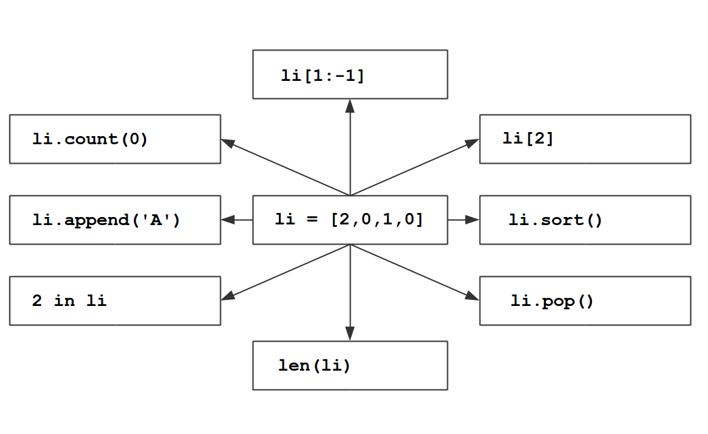
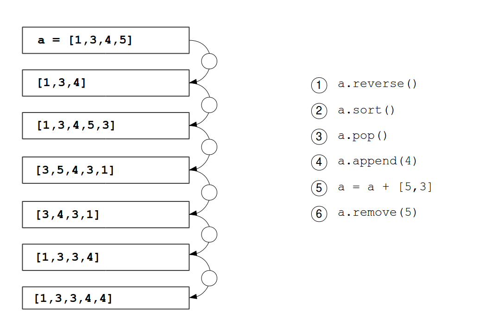

# Listen

Um größere Datenmengen zu verarbeiten, können wir nicht für jeden Eintrag einen neuen Variablennamen ausdenken. Irgendwie muß es möglich sein, mehrere Datensätze in einer Variable zu speichern. In Python treten an dieser Stelle **Listen** auf die Bühne.

### Aufgabe 1

Finde in IPython heraus, was die Ausdrücke mit der Liste in der Mitte anstellen.

### Aufgabe 2

Gegeben ist die folgende Liste mit den 10 beliebtesten Jungennamen aus dem Jahr 2000:

    top_ten = [34465, 32025, 28569, 27531, \
        24928, 23632, 22818, 22307, 21500]

Wie viele Babys sind das insgesamt? Schreibe ein Programm, welches diese Zahl ermittelt.
Die folgende Programmzeile ist dabei hilfreich:

    ...
    for anzahl in top_ten:
        ...

### Aufgabe 3

Im Jahr 2000 wurden in den USA insgesamt 1962406 Geburten von Jungen registriert. Welchen Anteil daran haben die 10 häufigsten Namen?

### Aufgabe 4

Welchen Anteil haben die 5 häufigsten Namen?

### Aufgabe 5

Gegeben sind die folgenden zwei Listen:

    top_ten_namen = ['Jacob', 'Michael', 'Matthew', 'Joshua', \
        'Christopher', 'Nicholas', 'Andrew', 'Joseph', \
        'Daniel', 'Tyler']

    top_ten_zahlen = [34465, 32025, 28569, 27531, \
        24928, 23632, 22818, 22307, 21500]

Schreibe ein Programm, welches alle Namen in einer linken Spalte und alle Zahlen in einer rechten Spalte ausgibt.

### Aufgabe 6

Erstelle eine neue Liste, welche für jeden der vier Namen die Summe von Kalifornien und New York enthält.

    # Emily, Amy, Penny, Bernadette (2014)
    california = [2269, 542, 54, 21]
    new_york = [881, 179, 12, 11]

### Aufgabe 7

Verwende die angegebenen Ausdrücke, um die Liste wie angegeben zu verändern. Verwende jeden Ausdruck genau einmal.

### Aufgabe 8

Verwende die angegebenen Ausdrücke, um die Liste wie angegeben zu verändern. Verwende jeden Ausdruck genau einmal.

