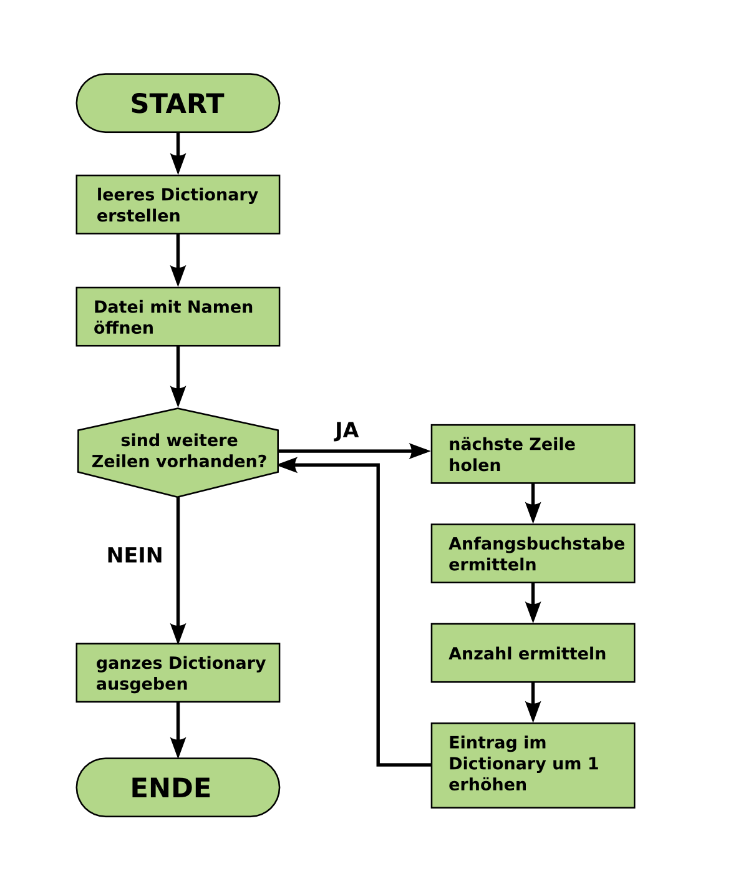

# Buchstaben zählen

In dieser Aufgabe werden wir ein Programm schreiben, das **die häufigsten Anfangsbuchstaben** in Babynamen ermittelt.

### Aufgabe 1

Betrachte das Flussdiagram. Beantworte folgende Fragen:

#### 1.1 Normale Funktionsweise

Was sollte nach Ausführen des Programms im Dictionary stehen, wenn folgende Datei verarbeitet wird?

    Penny,F,342
    Leonard,M,384
    Sheldon,M,164
    Stuart,M,82

#### 1.2 Leere Datei

Was wird voraussichtlich ausgegeben, wenn die Datei leer ist?

#### 1.3 Datenfehler

Durch einen Datenfehler enthält die Eingabedatei eine Leerzeile. An welcher Stelle des Flussdiagramms könnten dadurch Probleme entstehen?

#### 1.4 Verbesserung

Die Anzahl wird im bestehenden Entwurf nicht verwendet. Schlage eine Verbesserung des Programms vor.

### Aufgabe 2

Jetzt fangen wir an, das Programm zu *implementieren*.

Schreibe zuerst den Code für die **erste** und die **letzte** Box im Flussdiagramm. 

Im leeren Dictionary kannst Du den Wert für alle Buchstaben auf `0` setzen:

    data = {
    	'A': 0,
    	'B': 0,
    	...
    }

Dies ist nicht die kürzeste Variante, aber am einfachsten zu verstehen.

Verwende `print()` für die Ausgabe.

Stelle sicher, dass das Programm läuft.

### Aufgabe 3

Baue als nächstes die Verarbeitung der Datei in das Programm ein. Schreibe dazu den Code für die restlichen Boxen im Flussdiagramm links, sowie die oberste Box rechts (*"nächste Zeile holen"*).

Dazu kannst Du eine `for`-Schleife verwenden, ähnlich denen aus früheren Programmen.

Stelle sicher, dass das Programm läuft.

### Aufgabe 4

Kümmere Dich nun um die Box *"Anfangsbuchstabe ermitteln"*.

Gib den in jeder Zeile ermittelten Anfangsbuchstaben aus.

Stelle sicher, dass das Programm läuft.

### Aufgabe 5

Kümmere Dich nun um die restlichen Boxen.

Um einen Wert in einem Dictionary zu erhöhen, kannst Du folgendes Muster verwenden:

    data[schluessel] = data[schluessel] + 1

oder kürzer:

    data[schluessel] += 1

Stelle sicher, dass das Programm läuft.

### Aufgabe 6

Vereinfache das Programm (das Erstellen des leeren Dictionaries), indem Du `setdefault` verwendest.

### Aufgabe 7

Erweitere das Programm, so dass es die Häufigkeit des Buchstabens `A` für alle Jahrgänge in einer Liste sammelt.

### Aufgabe 8

Plotte den Inhalt der Liste.

### Aufgabe 9

Sammle **alle** Buchstabenhäufigkeiten für **alle** Jahrgänge im Dictionary.

Dazu enthält das Dictionary für jeden Buchstaben eine Liste, z.B.:

data = {
    'A': [100, 103, 107, ..],
    'B': [73, 32, 22, ..],
    ..
}
