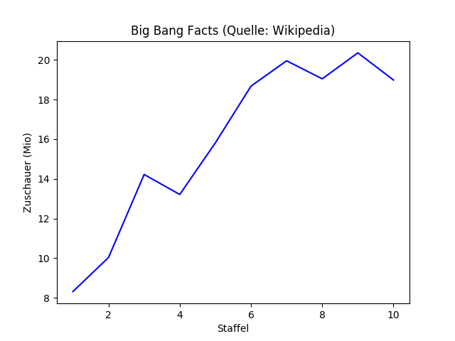

# Eine Zeitreihe erstellen

In diesem Kapitel werden wir untersuchen, wie sich die Häufigkeit einiger Namen im Laufe der Zeit entwickelt. Dazu müssen wir nicht nur *eine*, sondern *alle* Dateien aus dem Datensatz nacheinander einlesen.

### Aufgabe 1

Verwende die Funktion `range()`, um Listen von Zahlen zu generieren. Du kannst die Ausgabe von `range()` mit der Funktion `list()` in eine Liste überführen:

    list(range(10))
    list(range(10, 20))
    list(range(10, 100, 10))
    list(range(20, 0, -2))

Erstelle eine Liste mit den Jahreszahlen **`[1880, 1881, 1882 ... 2015]`**.

## Aufgabe 2

Erstelle eine Liste von Dateinamen **['yob1880.txt', 'yob1881.txt' … 'yob2015.txt']**. 

### Aufgabe 3

Das folgende Programm berechnet die Gesamtzahl der Geburten der vergangenen 130 Jahre.

Im Programm verstecken sich mehrere *semantische Fehler*. Führe das Programm aus. Inspiziere die Ausgabe. Finde und repariere den Fehler.

    for jahr in range(1890, 2015, 1):
        summe = 0
        filename = 'names/yob{}.txt'.format(jahr)
        for zeile in open(filename):
            spalten = zeile.strip().split(',')
        summe += sum(int(spalten[2]))

    print("\nErgebnis: {} Geburten insgesamt".format(summe))

### Aufgabe 4

Schreibe ein Programm, welches Zeilen mit Deinem Namen in den Jahrgängen von 1880 bis 2014 ausgibt.

### Aufgabe 5

Erweitere das Programm, so dass auch das Geschlecht vorgegeben ist. Gib nur die Zeilen mit Übereinstimmung in der Spalte mit `'M'` oder `'F'` aus.

### Aufgabe 6

Sammle sämtliche Übereinstimmungen in einer Liste

### Aufgabe 7

Falls in einem Jahrgang keine Übereinstimmung gefunden wurde, füge eine `0` zur Liste hinzu.

<!--sec data-title="Hinweis" data-id="hint-zeitreihe-null"
data-collapse=true ces-->

Setze vor Einlesen einer Datei eine Variable mit der Anzahl auf `0`. Falls Du Deinen Namen findest, ändere den Inhalt dieser Variablen. Füge nach Verarbeiten der Datei die Anzahl zur Liste mit dem Ergebnis hinzu.

<!--endsec-->

### Aufgabe 8

Führe folgendes Programm zum Zeichnen eines Liniendiagramms aus:

    from pylab import figure, xticks, plot, savefig,\
                      xlabel, ylabel, title
    
    figure()
    
    x = list(range(1, 11))
    y = [8.31, 10.03, 14.22, 13.21, 15.82,
         18.68, 19.96, 19.05, 20.36, 18.99]
    
    plot(x, y, 'b-')
    
    title('Big Bang Facts (Quelle: Wikipedia)')
    xlabel('Staffel')
    ylabel('Zuschauer (Mio)')

### Aufgabe 9

Passe das Programm so an, dass es die Häufigkeit Deines Namens ausgibt.

### Aufgabe 10

Probiere prominente Namen aus und plotte deren Zeitreihe (Tips: *Madonna, Luke Skywalker, Harley Davidson, Tyrion Lannister, Khaleesi, Sheldon*)

<!--sec data-title="Hinweis" data-id="hint-zeitreihe-plot"
data-collapse=true ces-->

Du kannst die Funktion `plot()` mehrmals aufrufen und so mehrere Linien im gleichen Diagramm erzeugen. 

<!--endsec-->

### Aufgabe 11

Normalisiere die Daten, indem Du die Häufigkeit mit der Gesamtzahl Geburten dieses Jahrgangs ins Verhältnis setzt.
