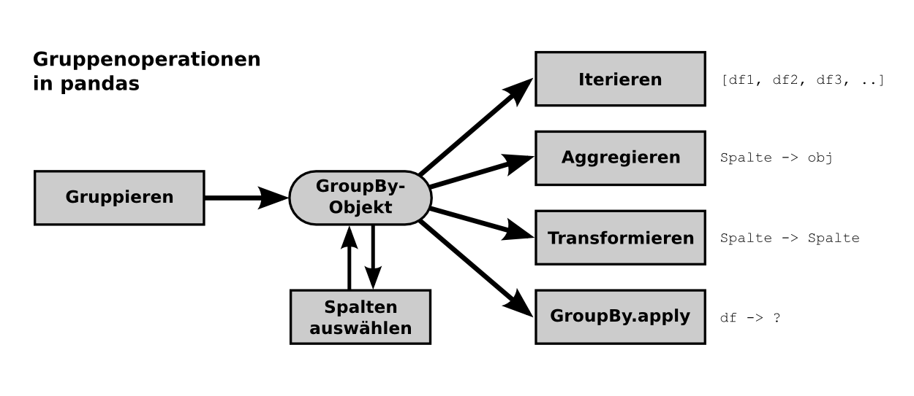

# Datenaggregation

### Aufgabe 1

Führe die Beispiele in `beispiele_gruppen.py` aus, so daß Du die *Gruppenobjekte* `g1` bis `g6` erhälst.

### Aufgabe 2

Wende auf jedes Gruppenobjekt eine oder mehrere 
der Aggregatfunktionen aus `beispiele_aggregation.py` an.

### Aufgabe 3

Erkläre eine zufällig bestimmte Kombination aus Gruppe und Aggregatfunktion

### Aufgabe 4

Lies den Datensatz von Babynamen für das Jahr 2014 in `pandas` ein. Beantworte folgende Fragen mit Hilfe von Aggregation:

* Wie viele unterschiedliche Namen von Jungen / Mädchen gibt es?
* Wie viele Jungen / Mädchen gibt es insgesamt?
* Wie sind Mittelwert/Standardabweichung der Anzahl von Jungen und Mädchen? 

### Aufgabe 5

Füge eine zusätzliche Spalte mit dem Anfangs- bzw. Endbuchstaben hinzu. Verwende dazu die Methode `df.apply(funktion)` wie in der `pandas`-Grundlagenübung gezeigt. Beantworte folgende Fragen.

* Welches sind die häufigsten 5 Anfangsbuchstaben?
* Welches sind die häufigsten 5 Endbuchstaben?

### Aufgabe 6

Lies alle 135 Jahrgänge in ein Dataframe ein. Folgende Codeschnipsel könnten dabei nützlich sein:

    df['jahr'] = 2015

    df = pd.concat([df1, df2, df3, ...])

### Aufgabe 7

Beantworte folgende Fragen:

* Wie viele unterschiedliche Namen gab es pro Jahr?
* Wie viele Babys gab es pro Jahr?
* Wie viele Babys gab es pro Jahr nach M/F gegliedert?
* Wie häufig waren alle Anfangsbuchstaben in einem Jahr?
* Wie häufig war der Name Maria in jedem Jahrzehnt?

### Aufgabe 8

Gegeben ist ein `DataFrame` mit folgender Struktur:

            name gender  count  year first last
    0       Mary      F   7065  1880     M    y
    1       Anna      F   2604  1880     A    a
    2       Emma      F   2003  1880     E    a
    3  Elizabeth      F   1939  1880     E    h
    4     Minnie      F   1746  1880     M    e

Was tut der folgende Befehl?

    pd.crosstab(names['first'], names['last'])
