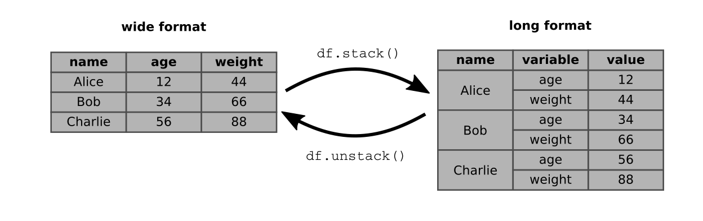

# Langes und breites Tabellenformat

In dieser Aufgabe werden wir den Zusammenhang von Lebenserwartung und Fruchtbarkeit untersuchen. Dazu werden wir einen Scatterplot für das Jahr 2015 anfertigen.

### Schritt 1

Lade die Datei `gapminder_fertility.csv` in pandas.

    import pandas as pd

    fert = pd.read_csv('gapminder_total_fertility.csv', index_col=0)

### Schritt 2

Verfahre genauso mit der Datei `gapminder_lifeexpectancy.xlsx`. Speichere es in einem `DataFrame` mit dem Namen `life`.

**Du benötigst dazu die Funktion `pd.read_excel`.**

### Schritt 3

Prüfe ob beide Tabellen die gleiche Größe haben

    print(life.shape)

**Wenn sie nicht die gleiche Größe haben, ist das nicht schlimm.**

### Schritt 4

Betrachte die Spalten der beiden Tabellen:

    fert.columns

und

    life.columns

Die eine Tabelle hat Strings als Spalten, die andere Integer-Zahlen. Um die Tabellen sinnvoll zusammenführen zu können, sollten beide das gleiche Format haben. Dazu erzeugen wir uns eine Liste mit den Jahrgängen als Integers.

    ncol = [int(x) for x in fert.columns]

und setzen diese Liste als neue Spaltennamen ein:

    fert.set_axis(axis=1, labels=ncol)

Prüfe mit `fert.columns`, ob die Umwandlung erfolgreich war.

### Schritt 5

Verbinde beide Tabellen mit der Funktion `merge`. Durch die Einstellung `left_index=True, right_index=True` werden Zeilen mit gleichem Index zusammengeführt.

    df = life.merge(fert, left_index=True, right_index=True)

Betrachte `df.columns`. Was ist passiert?

### Schritt 6

Um schönere Spaltennamen zu erhalten, kannst Du Dir auch einen **hierarchischen Index** basteln. Dazu wandeln wir beide Tabellen in ein *langes Tabellenformat* um:

    sfert = fert.stack()
    slife = life.stack()

Die beiden Variablen `sfert` und `slife` sind nun vom Type `pd.Series`. Mehrere Series lassen sich über ein Dictionary in ein `pd.DataFrame` umwandeln:

    d = {'fertility': sfert, 'lifeexp': slife}
    df2 = pd.DataFrame(data=d)

Diese riesige Tabelle lässt sich leichter in ein beliebiges Format bringen, wenn wir zunächst alle Indizes (Zeilen und Spalten) als Zeilenindizes aufstapeln:

    df3 = df2.stack()

Zum Schluß können wir aus der *langen* wieder eine *breite* Tabelle machen. Dazu erzeugen wir aus der ersten und dritten Ebene des Index (den Ländernamen und den Eigenschaften) neue Spalten:

   df4 = df3.unstack((0,2))

Die Null steht für das jeweils erste Element des Index, mit 1 würden die Jahreszahlen in die Spalten rutschen.

Nun sollte `df4` eine Tabelle sein, in der links die Jahreszahlen stehen und oben die Lebenserwartung und Fruchtbarkeit für alle Länder.

### Schritt 7

Nun kannst Du gezielt Spalten auswählen und plotten:

    import pylab as plt
    df4[['Germany', 'France', 'Sweden']].plot()

Du kannst auch einen Scatterplot erzeugen, um Korrelationen zu suchen. Dazu ziehen wir uns die Spalten, nach denen wir plotten möchten aus `df3`:

    df5 = df3.unstack(2)
    df5.plot.scatter('fertility', 'lifeexp', s=0.1)

Wir können durch die Operationen `stack` und `unstack` auch einen Jahrgang auswählen. So wird die Graphik etwas übersichtlicher:

    df6 = df3.unstack(1)  # Jahre als Spalten
    df6 = df6[1950]       # nur ein Jahrgang
    df6 = df6.unstack(1)  # Eigenschaften als Spalten
    df6.plot.scatter('fertility', 'lifeexp', s=0.1)

### Schritt 8

Das Ganze bietet noch etwas Raum für Verschönerungen. Beispielsweise kannst Du jedem Land eine andere Farbe geben:

    cmap = plt.get_cmap('tab20').colors
    df6.plot.scatter('fertility', 'lifeexp', s=0.1, c=cmap)

oder für die Größen der Punkte eine dritte Spalte verwenden, wenn Du eine hast:

    df6.plot.scatter('fertility', 'lifeexp', s=df6['population'])
