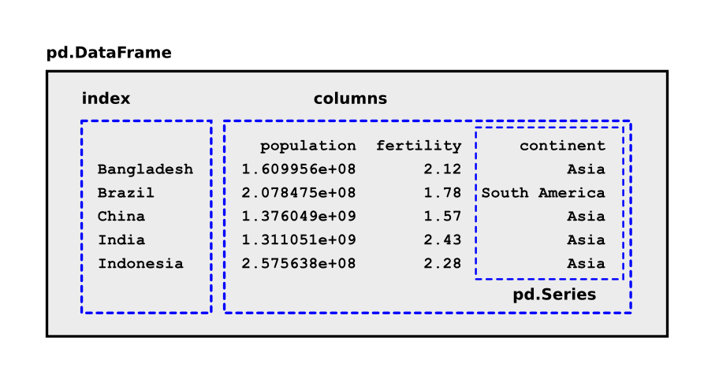

# Einstieg in pandas

.

In der Bibliothek `pandas` sind Daten als Tabellen vom Typ `pd.DataFrame` abgelegt. Diese **DataFrames** bestehen aus einem Index und mehreren Spalten. Jede Spalte hat den Typ `pd.Series`.

In dieser Übung probieren wir einige pandas-Befehle aus. Finde heraus, was diese tun.

## Vorbereitung

Du benötigst vom Kursleiter die Datei `grosse_laender_2015.csv` mit Daten von [www.gapminder.org](www.gapminder.org) und einige Python-Skripten vom Kursleiter.

### Aufgabe 1

Starte die IPython Konsole über Anaconda

### Aufgabe 2

Importiere pandas:

    import pandas as pd

### Aufgabe 3

Lade die Tabelle mit demographischen Daten:

    df = pd.read_csv('grosse_laender_2015.csv', index_col=0)

### Aufgabe 4

    Probiere die Befehle **einzeln** aus. Finde heraus, was diese tun.
