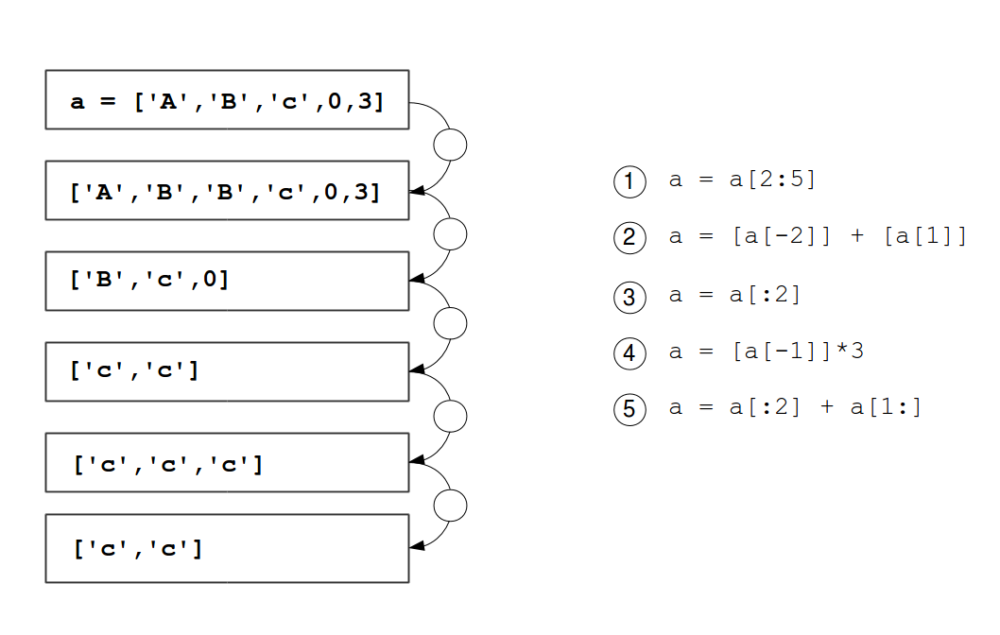

# Creating lists

### Exercise 1

Find out what each of the expressions does to the list in the center.

### Exercise 2

What does the following program do?

    top8 = [34465, 32025, 28569, 27531, \
            24928, 23632, 22818, 22307]

    for value in top8:
        print(value)

### Exercise 3

How many babies are there in total? Write a program that calculates that number.

### Exercise 4

You have a list of the 20 most popular girls names from the year 2000:

    ['Emily', 'Hannah', 'Madison', 'Ashley', 'Sarah', 
    'Alexis', 'Samantha', 'Jessica', 'Elizabeth', 'Taylor', 
    'Lauren', 'Alyssa', 'Kayla', 'Abigail', 'Brianna', 
    'Olivia', 'Emma', 'Megan', 'Grace', 'Victoria']

Write a program that prints all names starting with `'A'` or `'M'`.

### Exercise 5

Use the expressions to modify the list as indicated. Use each expression once.

### Exercise 6

Create a new list containing the sum of *California* and *New York* for each name.

    names = ["Emily", "Amy", "Penny", "Bernadette"]
    california = [2269, 542, 54, 21]
    new_york = [881, 179, 12, 11]

### Exercise 7

Use the expressions to modify the list as indicated. Use each expression once.

