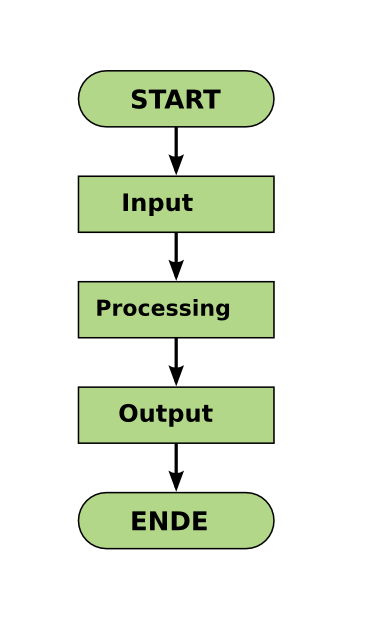

# Writing Python programs

A program consists of multiple lines that are executed in one go.

Usually a program contains the following sections:

Of course, programs can grow a lot more complicated than that.

In this chapter, we will learn to know the `print()` function for producing output, loops and branching statements.

## Turing Completeness

In the second part of the tutorial, you will learn a basic set of Python commands. Theoretically, they are sufficient to write any program on the planet (this is called *Turing completeness*). 

Practically, you will need shortcuts that make programs prettier, faster, and less painful to write. We will save these shortcuts for the later parts.
