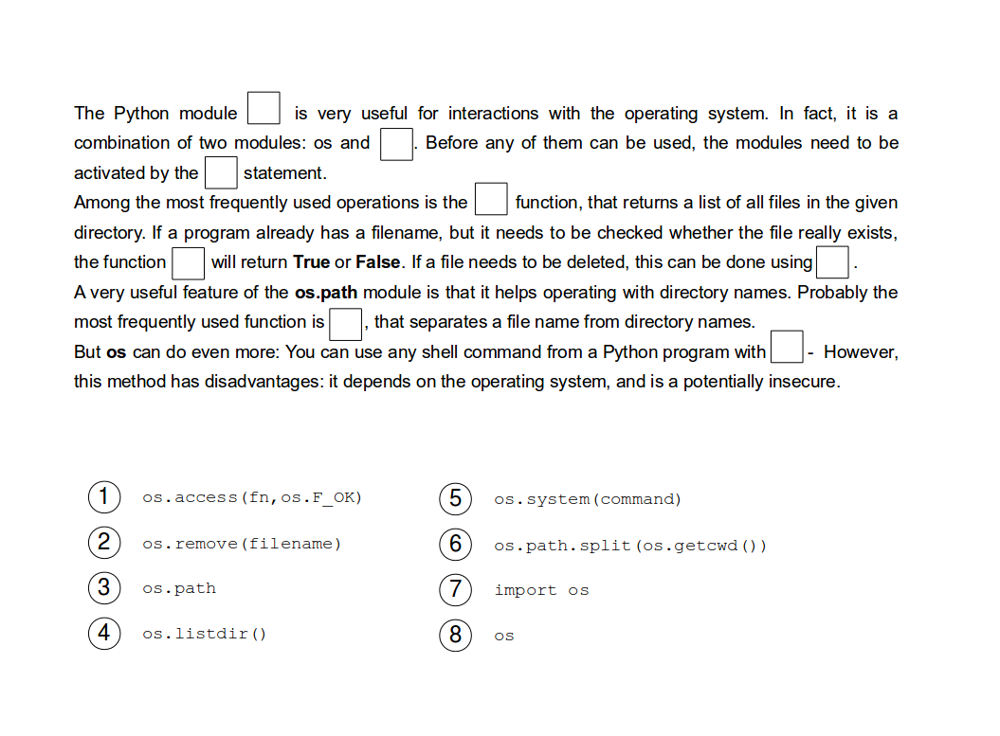

Baby Names
==========

In this chapter you will:
-------------------------

======= ====================================
area    topic
======= ====================================
🚀      analyze birth statistics
💡      use the ``open`` function to read and write files
💡      use the ``os`` module to loop through a directory
🔀      parse comma-separated files
🐞      fix FileNotFound errors
======= ====================================

The dataset of U.S. baby names
------------------------------

.. figure:: ../images/baby.png
   :alt: Babynames

For this chapter, you will need to download a data set of baby
names. The authorities of the United States have recorded the first
names of all people born as U.S. citizens since 1880. The dataset is
publicly available on `www.ssa.gov/oact/babynames/limits.html <http://www.ssa.gov/oact/babynames/limits.html>`__. 

Download the shorter archive of baby names (not grouped by states).

.. note::

   For the protection of privacy only names used
   at least 5 times appear in the data.

Exercise 1: Read a file
-----------------------

Unzip the downloaded archive and place the folder next to your Python program.
Read one of the files by inserting ``line``, ``line``, ``open`` and
``print`` into the gaps.

.. code:: python3

   for ___ in ___(r"names/yob2022.txt"):
       if "Maria" in ___:
          ___(line)

.. hint::

   Depending on your editor, you may need to insert the complete path to
   the file insted of ``names/``.
   On Windows, the ``r`` is important to have Python correctly interpret
   backslashes as separators.

Exercise 2: Distinct names
--------------------------

How many different *girls names* were there in 2022?

**Sort** the following code lines and **indent them correctly**:

.. code:: python3

   girls = 0
   if "B" in line:
   print(girls)
   if ",F," in line:
   for line in open(r"names/yob2022.txt"):
   girls += 1

Exercise 3
----------

Extend the program from the previous exercise such that boys and girls
names are counted separately.

Exercise 4: Frequent names
--------------------------

The following program collects names in a list that occur at least 10000
times. Unfortunately, the program contains **four errors**. Find and fix
these.

.. code:: python3

   frequent = []

   for line in open(r"names/yob2022.txt"):
       columns = line.strip().split(",")
       name = colums[1]
       if int(columns[3]) >= 10000
           frequent.append(name)

   print(frequent)

Exercise 5: Total babies
------------------------

Write a program that calculates the total number of babies for the year
2022 and writes it to the screen. Compare that number with the year 1922.

Exercise 6: Read and write
--------------------------

Form pairs of Python commands and their meanings.

.. figure:: ../images/files.png
   :alt: file exercise

Exercise 7: Write a file
------------------------

Execute the following program. Explain what happens.

.. code:: python3

   names = ["Ada", "Bob", "Charlie", "Dorothy"]

   with open(r"names.txt", "w") as f:
      for name in names:
          f.write(name + "\n")

.. hint::

   What happens if you remove the ``\n`` from the program?

Exercise 8: f-Strings
---------------------

Try the following commands in a Python shell:

.. code:: python3

   name = "Ada"
   number = 42
   pi = 3.14159

   print(f"{name}")
   print(f"{name:>10}")
   print(f"{number:5d}")
   print(f"{number:05d}")
   print(f"{pi:4.1f}")
   print(f"{pi:6.3f}")
   print(f"name: {name}    number: {number}    pi: {pi:6.3f}")

Exercise 9: Directories
-----------------------

To process bigger amounts of data, you will need to work on more than
one file. Sometimes you don’t know all the files in advance.
The ``os`` module is quite useful for working with many files and directories.

Fill in the gaps:

Exercise 10
-----------

Explain the following code:

.. code:: python3

   import os

   for dirname in os.listdir(r"names/"):
       print(dirname)

Recap: Read and write text files
--------------------------------

Insert working code into the blanks:

::

   # 1. Create a list with the numbers 1..7
   ...

   # 2. Convert the numbers to a string
   ...

   # 3. Open a file for writing
   ...

   # 4. Write the numbers to the file
   ...

   # 5. Open the file for reading
   ...

   # 6. Read all numbers in a list
   ...

   # 7. Sum up the numbers
   ...

Reflection Questions
--------------------

-  How do you know that a file path in a program is wrong?
-  What do you need to check if a file path in a program is wrong?
-  How to print all file names in a folder?
