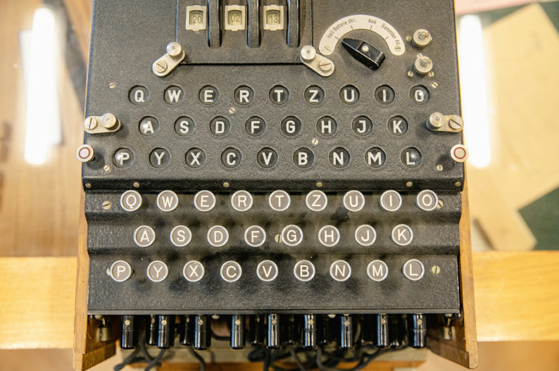

Cesar Cypher
============

Photo by `Christian Lendl on unsplash.com <https://unsplash.com/@dchris?utm_content=creditCopyText&utm_medium=referral&utm_source=unsplash>`__

In this chapter you will:
-------------------------

======= ====================================
area    topic
======= ====================================
🚀      encrypt and decrypt text
⚙       index the positions of a string
⚙       loop over a string
💡      use the ``find`` method of the ``string`` data type
🔀      build a longer string by concatenation
🔀      use the same index for two strings
🐞      fix index errors
======= ====================================

Exercise 1: Cesar Cypher
------------------------

Execute the following code calculating a **Cesar Cypher**:

.. code:: python3

   plain = "ABCDEFGHIJKLMNOPQRSTUVWXYZ "
   encrypted = "DEFGHIJKLMNOPQRSTUVWXYZABC "

   for i in range(26):
       print(plain[i], " -> ", encrypted[i])

Explain what the code does.

Exercise 2: String methods
--------------------------

Find out what the expressions do to the string in the middle.

.. figure:: strings.png

Exercise 3: Loop over a string
------------------------------

The following program should print the position in the alphabet of every character.
Complete program by inserting ``char``, ``message``, ``plain`` and ``position``:

.. code:: python3

   plain = "ABCDEFGHIJKLMNOPQRSTUVWXYZ "
   message = "MY SECRET MESSAGE"

   for char in ___:
       position = ___.find(___)
       print(char, "is in position", ___)

Why is the space at the end of ``plain`` important?

Exercise 4: String concatenation
--------------------------------

Explain the following code:

.. code:: python3

   encrypted = "DEFGHIJKLMNOPQRSTUVWXYZABC "

   s = ""
   s += encrypted[4]
   s += encrypted[1]
   s += encrypted[8]
   s += encrypted[8]
   s += encrypted[11]
   print(s)

Exercise 5: Encryption
----------------------

Write a program that:

1. defines a plain and encrypted alphabet as a 26-character string
2. reads a message from the keyboard
3. defines an empty result string
3. goes through each character of the message
4. finds the position in the plain text alphabet
5. looks up that position in the encrypted alphabet
6. adds the encrypted character to the result string
7. when all characters have been processed, output the result

.. hint::

   After each step, you should be able to run the program
   and see what it already does.

Exercise 6
----------

Explain why the following code does the same as in exercise 1:

.. code:: python3

   plain = "ABCDEFGHIJKLMNOPQRSTUVWXYZ"
   for i in range(26):
       print(plain[i], " -> ", plain[(i + 3) % 26])

Can you use it to make your encryption program shorter?

.. hint::

   If you are not sure what happens, print the value of ``i`` inside the loop.

Exercise 7
----------

Also write a program for **decryption**.

.. hint::

   How could you make sure that the input string is in upper case?

Reflection questions
--------------------

-  what happens when a string is followed by square brackets?
-  describe two ways to loop over the characters of a string?
-  what does the ``str.find()`` method do?
-  how can you add characters to a string?
