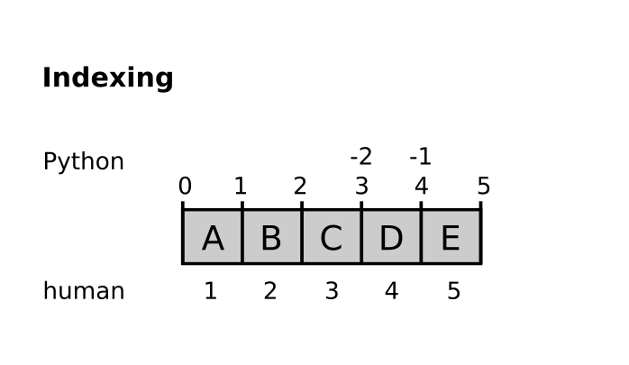

Block Cipher
============

In this chapter you will:
-------------------------

======= ====================================
area    topic
======= ====================================
🚀      implement a transposition cipher
⚙       slice lists and strings
💡      use the ``join`` method of the ``string`` data type
🔀      use a loop variable for indexing
======= ====================================

Indexing and Slicing
--------------------

Strings and lists are both ordered sequences of elements.
In both, you can address elements by their position.
However, Python is counting differently than humans:

Exercise 1: Indexing lists
--------------------------

What do the following expressions result in?

.. code:: python3

   numbers = [1, 4, 9, 16, 25, 36]

   numbers[4]
   movies[0]
   movies[-1]
   numbers[-3]

Exercise 2: Slicing strings
---------------------------

What do the following commands result in?

   name = "hello world"

   name[5:]
   name[5:10]
   name[:10:2]
   numbers[2:-2]
   numbers[::2]

Exercise 3: Decypher
--------------------

The following text contains an encrypted word:

.. code:: python3

   name = "CSAIPRALKAINACZEYLVOST"

Print every second character, starting with the 2nds.

Exercise 4: Slicing puzzle
--------------------------

Use the expressions to modify the list as indicated. Use each expression
once.

.. figure:: list_funcs1.png
   :alt: list funcs exercise1

Exercise 5: Blocks
------------------

The following code is creating the first two blocks for a `transposition cipher <https://en.wikipedia.org/wiki/Transposition_cipher>`__ .
Complete the code by creating the other two blocks as well.

.. code:: python3

   message = "MEETINGATDAWNATTHEBRIDGE"

   block1 = message[0::4]
   block2 = message[1::4]
   ___
   ___
   encrypted = block1 + block2 + block3 + block4

Exercise 6: Transposition Cipher
--------------------------------

Complete the program that encrypts a text using a transposition cipher:

.. code:: python3

   message = input("enter the text to encrypt: ")
   encrypted = ""
   for start in range(4):
       ___

Exercise 7: Decrypt
-------------------

Write a program to decrypt an encrypted message again.
