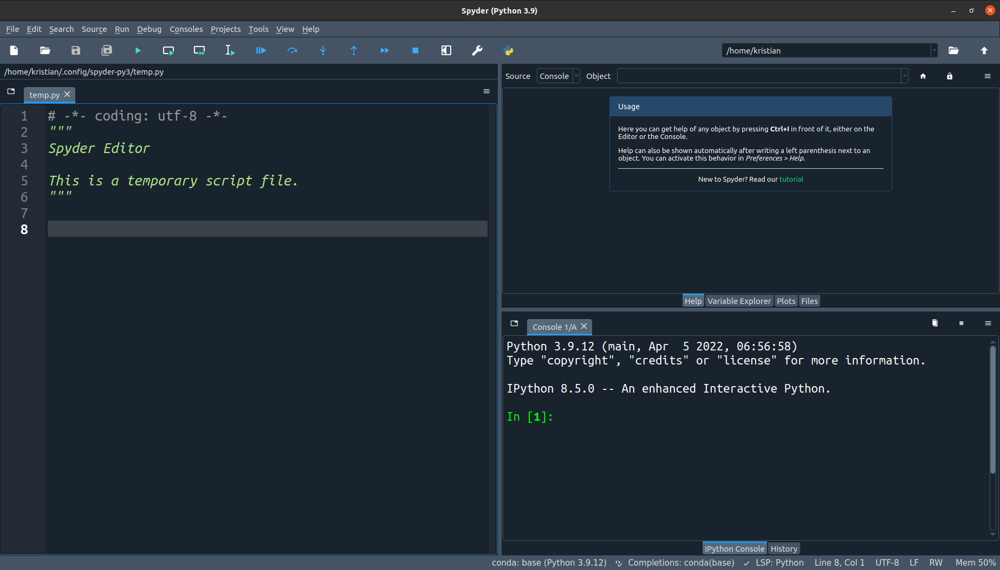

# Installing Python

The first step into programming is to get Python installed on your computer.
You will need two programs: **Python** itself and an **editor** to write code.
A convenient way to install both in one go is **Anaconda**, a Python distribution with many pre-installed packages.
Download it from [www.anaconda.com](https://www.anaconda.com/) and follow the instructions.

After installing, launch the **Spyder** editor from the **Anaconda Navigator**.
It should look like this:

### Troubleshooting

Generally, you can use any text editor to write Python code.
Besides Spyder, I recommend **Visual Studio Code** and **PyCharm**, although both are not that easy to configure.

If you prefer to use the standard Python installation, you find it on [www.python.org](https://www.python.org/downloads/).

In that case, install spyder using the Python package manager `pip`. Type:

    pip install spyder

### Reflection Questions

* Which text editors are installed on your system?
* Which Python version are you running?
