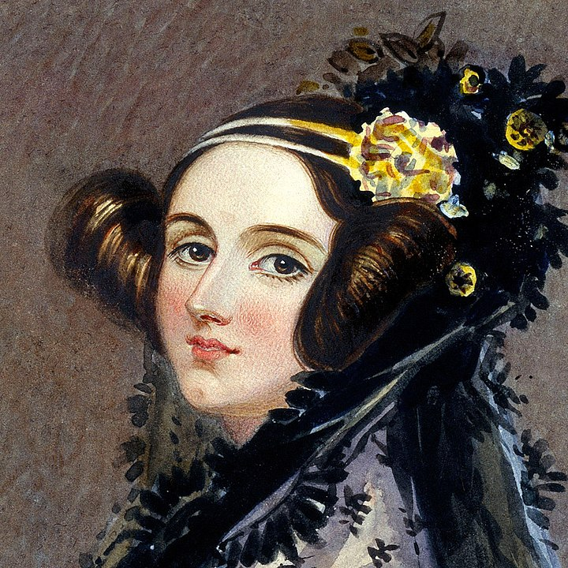

Ada Lovelace
============

   Ada Lovelace

`Ada Lovelace, image by Alfred Edward Chalon - Biography.com, public
domain <https://commons.wikimedia.org/w/index.php?curid=25519820>`__

In this chapter you will:
~~~~~~~~~~~~~~~~~~~~~~~~~

==== =================================
area topic
==== =================================
🚀   calculate the age of Ada Lovelace
⚙    distinguish data types
💡    use the data type ``float``
💡    convert data types
🐞    recognize bugs at runtime
==== =================================

Python contains many functions for **type conversion**.

With the functions ``int()``, ``float()`` and ``str()`` you can convert
numbers and strings into each other.

--------------

Exercise 1: Ada Lovelace
~~~~~~~~~~~~~~~~~~~~~~~~

**Ada Lovelace** was the first human to write a computer program.
This was quite an achievement, given that Ada had to imagine a computer first!

Insert the following pieces into the gaps, so that all instructions are
executed correctly: ``age``, ``int(age)``, ``name``, ``str(born)``,
``1815``

.. code:: python3

   name = "Ada Lovelace"
   born = ...
   ...  = "37"

   text = ... + " was born in the year " + ... + "."
   year = born + ...
   print(text)
   print(year)

--------------

Exercise 2: Nine plus nine
~~~~~~~~~~~~~~~~~~~~~~~~~~

Insert ``int()`` or ``str()`` into the instructions, so that all of them
run without an error.

.. code:: python3

   9 + 9
   9 + '9'
   '9' + '9'
   9 * '9'

--------------

Exercise 3: Output
~~~~~~~~~~~~~~~~~~

Which ``print`` statements work?

.. code:: python3

   print("9" + "9")
   print "nine"
   print(str(9) + "nine")
   print(9 + 9)
   print(9 + int("9"))
   print(nine)
   print(float("9") + int(9.0))

--------------

Exercise 4: Debugging
~~~~~~~~~~~~~~~~~~~~~

The following code should calculate the age of Ada in a year entered by
the user. It contains three bugs. Find and fix them.

.. code:: python3

   year_of_birth = 1815
   year = input('Which year is it? ')
   age = year_of_birth - year

   print("Today, Ada Lovelace would be " + age + " years old.")    
