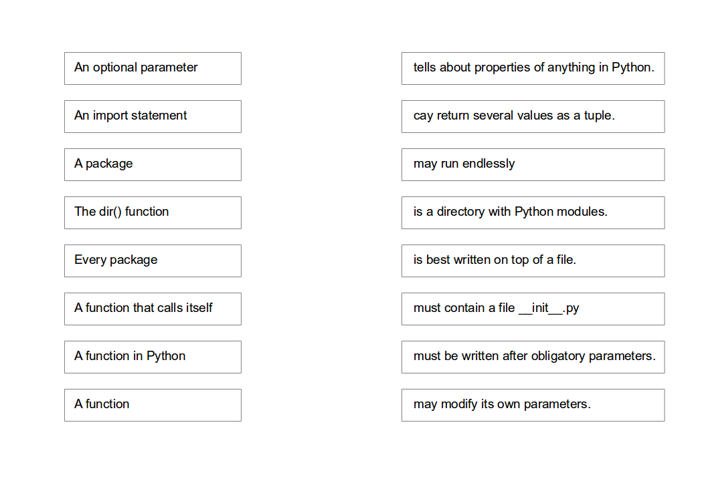

# Modules and Packages

## Exercises

### Exercise 1

Join the right halves of sentences.

### Exercise 2

Which `import` statements are correct?

- [ ] `import re`
- [ ] `import re.sub`
- [ ] `from re import sub`
- [ ] `from re import *`
- [ ] `from re.sub import *`

## Exercise 3

Where does Python look for modules to import?

- [ ] in the variable `sys.path`
- [ ] in the current working directory
- [ ] in the directory where the current module is
- [ ] in the `site-packages` folder
- [ ] in directories in the `PYTHONPATH` variable

## Exercise 4

Which statements about packages are true?

- [ ] a package is a directory with modules
- [ ] a package must contain a file `__init__.py`
- [ ] a package may contain no code
- [ ] a module may contain many packages

## Exercise 5

Which packages are installed by default?

- [ ] `os` - manipulating files and directories
- [ ] `time` - accessing date and time
- [ ] `csv` - read and write tables
- [ ] `numpy` - number crunching
- [ ] `pandas` - clever handling of tabular data

