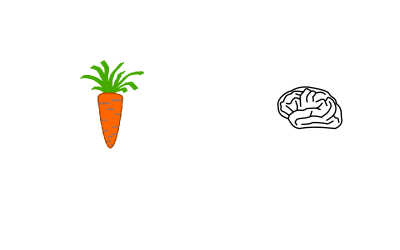
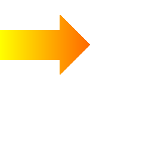
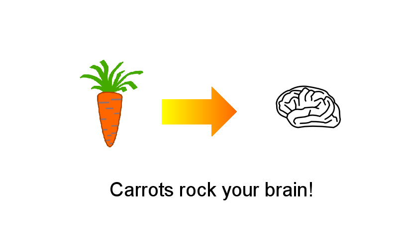

# pillow

## What is pillow?

`pillow` is a Python module for image manipulation. It derives from the **Python Imaging Library (PIL)**.

**PIL** has been around since 2002, but **Pillow** is the currently maintained distribution. 

## Installation

    pip install pillow

## Where to learn more?

[pillow.readthedocs.org](http://pillow.readthedocs.org)

## Exercises

### Exercise 1

Execute a program for converting an image format.

    from PIL import Image

    carrot = Image.open('carrot.png')
    img.save('carrot.jpg')

### Exercise 2

Execute a program to merge two images.

    from PIL import Image

    img = Image.new('RGBA', (800, 500), 'white')

    carrot = Image.open('carrot.png')
    brain = Image.open('brain.png')

    img.paste(carrot, (100, 80))
    img.paste(brain, (500, 100))

    img.save('step01.png')

### Exercise 3

Execute the program to resize an image.

    from PIL import Image

    img = Image.new('RGBA', (800, 500), "white")

    carrot = Image.open('carrot.png')
    brain = Image.open('brain.png')

    carrot = carrot.resize((250, 250))

    img.paste(carrot, (100, 80))
    img.paste(brain, (500, 100))

    img.save('step02.png')

### Exercise 4

Execute the program to draw an arrow

    from PIL import Image, ImageDraw

    arrow = Image.new('RGBA', (250, 250), "white")

    draw = ImageDraw.Draw(arrow)
    draw.rectangle((0, 50, 100, 100), fill="black")
    draw.polygon((100, 25, 100, 125, 150, 75), fill="black")

    arrow.save('arrow.png')

### Exercise 4

Execute the program to draw a gradient.

    from PIL import Image, ImageDraw
   
    gradient = Image.new('RGBA', (250, 250), "white")
    draw = ImageDraw.Draw(gradient)
   
    for x in range(250):
        box = (x, 0, x+1, 250)
        color = (255, (255-x), 0)
        draw.rectangle(box, fill=color)
	    
    gradient.save('gradient.png')

### Exercise 5

Execute the program to superimpose two images   

    from PIL import Image, ImageChops
	
    arrow = Image.open('arrow.png')
    gradient = Image.open('gradient.png')
 	
    arrow = ImageChops.screen(arrow, gradient)
    
    img.save('grad_arrow.png')

#### More Filter Examples:

    f1 = ImageChops.multiply(brain, carrot)
    f2 = ImageChops.blend(brain, carrot, 0.2)
    f3 = ImageChops.screen(carrot, gradient)

# Exercise 6

Combine the carrot, brain and arrow into one image.

# Exercise 7

Add text to the image

    from PIL import ImageFont

    draw = ImageDraw.Draw(img)
    arial = ImageFont.truetype('arial.ttf', 40)
    draw.text((220, 360), "Carrots rock your brain!", 
              fill=(0,0,0), font=arial)
    img.save('step06.png')
   

### Exercise 7

#### Bonus:
**Write a 70-line script that**

1. Cuts a picture into many small images
2. Moves the pieces randomly
3. Writes out frames after each move
4. Call MEncoder (on Windows)

#### Calling MEncoder:

    mencoder "mf://*.png" -mf fps=25 -o output.avi 
    -ovc lavc -lavcopts vcodec=mpeg4
