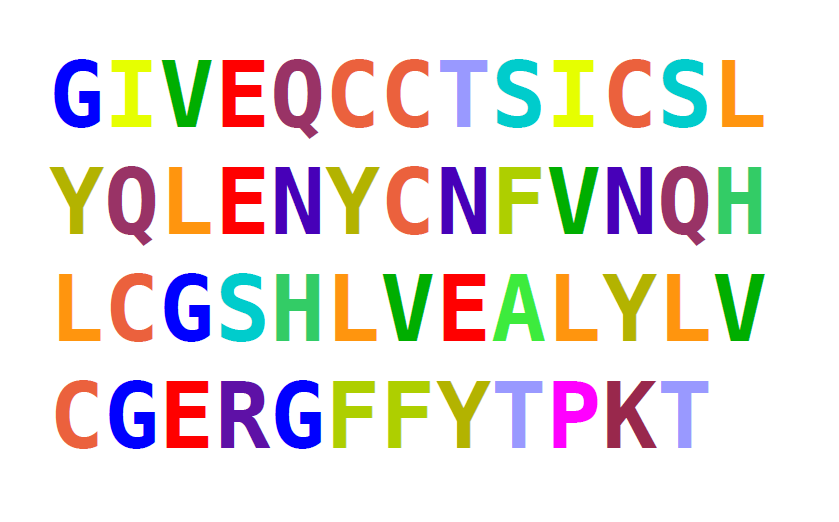

# Making decisions

The last missing piece in our basic set of commands is the ability to make decisions in a program. This is done in Python using the `if` command.

### Exercise 1

Execute the following program and explain its output.

    number = 123

    if number > 1000:
        print("The number is larger than 1000.")
    elif number == 1000:
        print("The numer is exactly 1000.")
    else:
        print("The number is smaller than 1000.")

### Exercise 2

Set `name` to such a value that one, two or all three conditions apply.

    name = ____

    if "m" in name:
        print("There is a 'm' in the name.")
        if name != "Mimi":
            print("The name is not Mimi.")
            if name[0] == "M" and name[-1] == "m":
                print("The name starts and ends with m.")

### Exercise 3

The following program writes the positions of all letters *"n"* in the name to the screen. Unfortunately, it contains **three errors**. Make the program execute correctly:

    name = "Anna"
    position = 1

    for char in name
        if char = "n":
            print(position)
    position = position + 1

### Exercise 4

Which of these `if` statements are syntactically correct?

* `if a and b:`
* `if len(s) == 23:`
* `if a but not b < 3:`
* `if a ** 2 >= 49:`
* `if a != 3`
* `if (a and b) or (c and d):`
