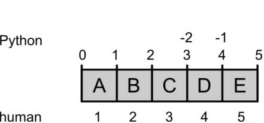

Indexing and Slicing
====================

**Computers and people count differently:**

   indices for humans and computers

Computers treat an address in memory as the *starting point* of a body
of data. In the same sense, an *index* in Python always refers to such a
starting point, something that is *in between* two objects in memory. We
humans in contrast always count the objects themselves.

This is why the indices used to slice lists are a bit unintuitive at
first, e.g. in:

.. code:: python3

   >>> s = "my fat cat"
   >>> s[3:6]
   'fat'

The diagram provides a practical model by which you can deduce indices
yourself.

Indexing
--------

Many data types (lists, strings) allow to index items by their position:

.. code:: python3

   s = 'my fat cat'
   s[0]  # first
   s[2]  # third
   s[-1] # last

Using and index that does not exist causes an ``IndexError``.

Slicing
-------

We can define intervals. This is called **slicing**:

.. code:: python3

   s = 'my fat cat'
   s[3:6]  # -> 'fat'

Slices may be open on either side:

.. code:: python3

   s[3:]  # -> 'fat cat'
   s[:6]  # -> 'my fat'

If you leave both number out, you copy the variable. This is sometimes a
neat trick, if you want to manipulate a list, but preserve the original.

.. code:: python3

   d = [1, 2, 3]
   e = d[:]
   d.append(4)
   len(d)  # is now 4
   len(e)  # still 3

You can define slices with a step size:

.. code:: python3

   s = 'my fat cat'
   s[1:8:2]  # -> 'yftc'
   s[:8:2]   # -> 'm a '
   s[1::2]   # -> 'yftct'

The step size may even be negative:

.. code:: python3

   s = 'my fat cat'
   s[::-1]  # -> 'tac taf ym'
