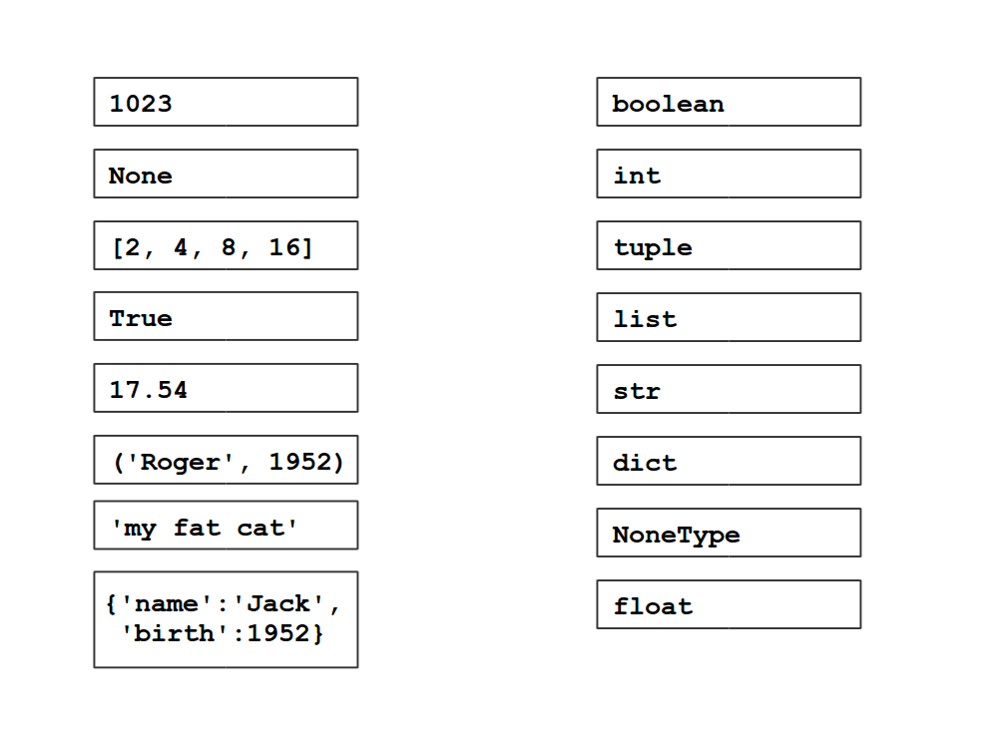

# Exercises

## Exercise 1:

What is the result of the following statements?

     9 + 9

     9 + '9'

     '9' + '9'

## Exercise 2:

Change the statements above by adding int() or str() to each of them, so that the result is 18 or '99', respectively.

## Exercise 3:

Explain the result of the following operations?

     9 * 9
     9 * '9'
     '9' * 9

## Exercise 4:

Write Python statements that create the following string:

    12345678901234567890123456789012345678901234567890

## Exercise 5:

Assign the following data types:

